# Sandbox Control Plane

[](README.md) [](README_ZH.md)

A cloud-native, production-ready platform for secure code execution in isolated container environments, designed for AI agent applications.

## Overview

The Sandbox Control Plane is a **production-ready, enterprise-grade** platform that provides secure, isolated execution environments for running untrusted code. Built with a stateless architecture and intelligent scheduling, it's optimized for AI agent workflows, data pipelines, and serverless computing scenarios.

## Architecture

The system adopts a **Control Plane + Container Scheduler** separation architecture:

```mermaid
flowchart TD
    %% 定义全局样式
    classDef external fill:#f9f9f9,stroke:#666,stroke-width:2px,color:#333;
    classDef control fill:#e1f5fe,stroke:#01579b,stroke-width:2px,color:#01579b;
    classDef scheduler fill:#fff3e0,stroke:#e65100,stroke-width:2px,color:#e65100;
    classDef storage fill:#f5f5f5,stroke:#424242,stroke-width:2px,color:#424242;
    classDef runtime fill:#e8f5e9,stroke:#1b5e20,stroke-width:2px,color:#1b5e20;
    classDef database fill:#ede7f6,stroke:#311b92,stroke-width:2px,color:#311b92;

    subgraph External ["🌐 外部系统 (External)"]
        Client(["📱 客户端应用"])
        Developer(["👨‍💻 开发者 SDK/API"])
    end

    subgraph ControlPlane ["⚙️ 控制平面 (Control Plane)"]
        direction TB
        API[["🚀 API Gateway (FastAPI)"]]
        Scheduler{{"📅 调度器 (Scheduler)"}}
        SessionMgr["📂 会话管理器"]
        TemplateMgr["📝 模板管理器"]
        HealthProbe["🩺 健康检查"]
        Cleanup["🧹 会话清理"]
        StateSync["🔄 状态同步"]
    end

    subgraph ContainerScheduler ["📦 容器编排 (Scheduler)"]
        DockerRuntime["Docker Runtime"]
        K8sRuntime["Kubernetes"]
    end

    subgraph Storage ["💾 存储层 (Storage)"]
        MariaDB[("🗄️ MariaDB")]
        S3[("☁️ S3 Storage")]
    end

    subgraph Runtime ["🛡️ 沙箱运行时 (Sandbox)"]
        Executor["⚡ 执行器 (Executor)"]
        Container["📦 容器实例"]
    end

    %% 这里的连接线逻辑
    Client & Developer --> API
    API --> Scheduler
    Scheduler --> SessionMgr & ContainerScheduler
    SessionMgr --> TemplateMgr & MariaDB
    ContainerScheduler --> DockerRuntime & K8sRuntime
    DockerRuntime & K8sRuntime --> Container
    Container --> Executor
    HealthProbe -.-> Container
    StateSync --> MariaDB & ContainerScheduler
    Cleanup --> SessionMgr
    API -.-> S3

    %% 应用样式
    class Client,Developer external;
    class API,Scheduler,SessionMgr,TemplateMgr,HealthProbe,Cleanup,StateSync control;
    class DockerRuntime,K8sRuntime scheduler;
    class MariaDB,S3 database;
    class Executor,Container runtime;

```



### Key Advantages

**Cloud-Native Architecture**
- Stateless Control Plane supporting horizontal scaling with Kubernetes HPA
- Dual runtime support: Docker (local/dev) and Kubernetes (production)
- Protocol-driven decoupling for flexible deployment

**Intelligent Scheduling**
- Template affinity scheduling for optimal resource utilization
- Session lifecycle controlled via API with global idle timeout and lifetime limits
- Built-in session cleanup with configurable policies

**Multi-Layer Security**
- Container isolation with network restrictions and capability dropping
- Optional Bubblewrap process-level namespace isolation
- Resource quotas with CPU/memory limits and process constraints

**Developer Experience**
- AWS Lambda-compatible handler specification for easy migration
- Web-based management console with real-time monitoring
- Comprehensive RESTful API with interactive documentation
- Template-based environment management

**Production Ready**
- State synchronization service for automatic recovery
- Health probe system for container monitoring
- S3-compatible storage integration for workspace persistence
- Structured logging with request tracing

## Key Features

| Feature | Description |
|---------|-------------|
| **Session Management** | Create, monitor, and terminate sandbox execution sessions with automatic cleanup |
| **Code Execution** | Execute Python/JavaScript/Shell code with result retrieval and streaming output |
| **Template System** | Define and manage sandbox environment templates with dependency caching |
| **File Operations** | Upload input files and download execution artifacts via S3-compatible storage |
| **Container Monitoring** | Real-time health checks, resource usage tracking, and log aggregation |
| **Intelligent Scheduling** | Template affinity optimization and load-balanced cold start strategies |
| **State Synchronization** | Automatic recovery of orphaned sessions on service restart |
| **Web Console** | React-based management interface for visual operations and monitoring |


### Design Principles

- **Control Plane Stateless**: Supports horizontal scaling with no local state
- **Protocol-Driven**: All communication via standardized RESTful API
- **Security-First**: Multi-layer isolation with defense-in-depth
- **Cloud-Native**: Designed for Kubernetes deployment with auto-scaling

### Component Overview

**Control Plane Components**:
- API Gateway: FastAPI-based RESTful endpoints with automatic validation
- Scheduler: Intelligent task distribution with template affinity
- Session Manager: Database-backed session lifecycle management
- Template Manager: Environment template CRUD operations
- Health Probe: Container monitoring and metrics collection
- Session Cleanup: Automatic resource reclamation
- State Sync Service: Startup health checks and recovery

**Container Scheduler**:
- Docker Scheduler: Direct Docker socket access via aiodocker
- K8s Scheduler: Kubernetes API integration for production deployments

**Storage Layer**:
- MariaDB: Session, execution, and template state storage
- S3-Compatible Storage: Workspace file persistence (MinIO/AWS S3)

## Quick Start
### Prerequisites


- **Docker**: 20.10+
- **Docker Compose**: 2.0+
- **Python**: 3.11+ (for local development)

### Hardware Requirements (Development Environment)

| Service | CPU | Memory |
|---------|-----|--------|
| control-plane | 0.25 ~ 1.0 cores | 600M ~ 1G |
| sandbox-web | 0.1 ~ 0.5 cores | 64M ~ 256M |
| minio | 0.1 ~ 0.5 cores | 128M ~ 512M |
| mariadb | 0.1 ~ 0.5 cores | 256M ~ 512M |
| **Total (Minimum)** | **~1 core** | **~1G** |
| **Total (Recommended)** | **~2 cores** | **~2G** |

> Note: The above resource requirements are for the docker-compose development environment. Adjust according to actual load in production environments.

### Build Images

Before starting the services, build the executor base image and template images:

```bash
cd images
./build.sh
```

The build script creates:
- `sandbox-executor-base:latest` - Base executor image
- `sandbox-template-python-basic:latest` - Python basic template

**Note**: The `control-plane` and `sandbox-web` images are built automatically by docker-compose.

### Using Mirror Sources (Optional)

If you're building images in a network environment with limited access to official repositories (e.g., mainland China), you can use mirror sources:

```bash
# Build executor images with mirror support
cd images
USE_MIRROR=true ./build.sh

# Build Control Plane with mirror
cd ../sandbox_control_plane
docker build --build-arg USE_MIRROR=true -t sandbox-control-plane .

# Build Web Console with mirror
cd ../sandbox_web
docker build --build-arg USE_MIRROR=true -t sandbox-web .
```

Available mirror sources:
- **Default**: USTC mirrors (Debian/APT, Alpine/APK, Python/pip)
- **Custom**: Use `--build-arg APT_MIRROR=your-mirror` to specify a custom mirror

### Start Services

```bash
cd sandbox_control_plane

# Start all services (Control Plane, Web Console, MariaDB, MinIO)
docker-compose up -d

# View logs
docker-compose logs -f control-plane

# Check service status
docker-compose ps
```

### Access Services

| Service | URL | Description |
|---------|-----|-------------|
| **API Documentation** | http://localhost:8000/docs | Swagger UI - Interactive API documentation |
| **Web Console** | http://localhost:1101 | React-based management interface |
| **MinIO Console** | http://localhost:9001 | S3-compatible storage management |

**Default Credentials**:
- MinIO: `minioadmin` / `minioadmin`

**Note**: Change default credentials in production environments.

### Quick Example

```bash
# Create a session using Python template
curl -X POST http://localhost:8000/api/v1/sessions \
  -H "Content-Type: application/json" \
  -d '{
    "template_id": "python-basic",
    "timeout": 300,
    "resources": {
      "cpu": "1",
      "memory": "512Mi",
      "disk": "1Gi"
    }
  }'

# Execute code (replace {session_id} with actual session ID)
curl -X POST http://localhost:8000/api/v1/sessions/{session_id}/execute \
  -H "Content-Type: application/json" \
  -d '{
    "code": "def handler(event):\n    return {\"result\": \"hello world\"}",
    "language": "python",
    "timeout": 30
  }'
```

## Development

### Running Tests

```bash
cd sandbox_control_plane

# Run all tests
pytest

# Run specific test categories
pytest tests/contract/
pytest tests/integration/
pytest tests/unit/

# Run with coverage
pytest --cov=sandbox_control_plane --cov-report=html
```

### Code Quality

```bash
# Format code
black sandbox_control_plane/ tests/

# Lint code
flake8 sandbox_control_plane/ tests/

# Type check
mypy sandbox_control_plane/
```

## Project Structure

```
sandbox/
├── sandbox_control_plane/    # FastAPI control plane service
│   ├── src/
│   │   ├── application/      # Application services (business logic)
│   │   ├── domain/           # Domain models and interfaces
│   │   ├── infrastructure/   # External dependencies (DB, Docker, S3)
│   │   ├── interfaces/       # REST API endpoints
│   │   └── shared/           # Shared utilities
│   ├── tests/                # Unit, integration, and contract tests
│   └── docker-compose.yml    # Local development setup
│
├── sandbox_web/              # React web management console
│   ├── src/                  # React components and pages
│   │   ├── pages/            # Page components
│   │   ├── components/       # Reusable components
│   │   ├── services/         # API client services
│   │   └── utils/            # Utilities
│   └── package.json          # NPM dependencies
│
├── runtime/executor/          # Sandbox executor daemon
│   ├── application/          # Execution logic
│   ├── domain/               # Domain models
│   ├── infrastructure/       # External dependencies
│   ├── interfaces/           # HTTP API endpoints
│   └── Dockerfile            # Executor container image
│
├── images/                    # Container image build scripts
│   └── build.sh              # Build executor base and template images
│
├── scripts/                  # Utility scripts
├── specs/                    # Implementation specifications
└── docs/                     # Documentation
```

## Documentation

- [Implementation Plan](specs/001-control-plane/plan.md)
- [Data Model](specs/001-control-plane/data-model.md)
- [API Contracts](specs/001-control-plane/contracts/)
- [Quickstart Guide](specs/001-control-plane/quickstart.md)
- [Research Decisions](specs/001-control-plane/research.md)
- [Technical Design](docs/sandbox-design-v2.1.md)

## License

[Your License Here]

## Contributing

[Your Contributing Guidelines Here]
