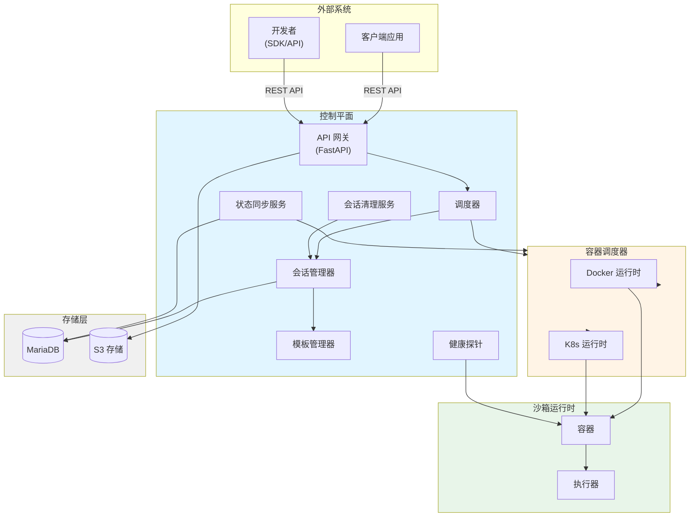

# Sandbox 控制平面

[](README.md) [](README_ZH.md)

一个云原生、生产就绪的平台，专为在隔离容器环境中安全执行代码而设计，适用于 AI 智能体应用。

## 概述

Sandbox 控制平面是一个**生产就绪、企业级**平台，提供安全、隔离的执行环境用于运行不受信任的代码。采用无状态架构和智能调度构建，专为 AI 智能体工作流、数据管道和无服务器计算场景优化。

### 核心优势

**云原生架构**
- 支持水平扩展的无状态控制平面，兼容 Kubernetes HPA
- 双运行时支持：Docker（本地/开发）和 Kubernetes（生产）
- 协议驱动的解耦设计，实现灵活部署

**智能调度**
- 模板亲和性调度，优化资源利用率
- 会话生命周期由 API 控制，支持全局空闲超时和生命周期限制
- 内置会话清理，可配置清理策略

**多层安全**
- 容器隔离，具备网络限制和权限剥离
- 可选的 Bubblewrap 进程级命名空间隔离
- CPU/内存限制和进程约束的资源配额

**开发者体验**
- AWS Lambda 兼容的处理器规范，易于迁移
- 基于 Web 的管理控制台，支持实时监控
- 完善的 RESTful API，提供交互式文档
- 基于模板的环境管理

**生产就绪**
- 状态同步服务，支持自动恢复
- 健康探针系统，监控容器状态
- S3 兼容存储集成，持久化工作空间
- 结构化日志，支持请求追踪

## 关键特性

| 特性 | 描述 |
|---------|-------------|
| **会话管理** | 创建、监控和终止沙箱执行会话，支持自动清理 |
| **代码执行** | 执行 Python/JavaScript/Shell 代码，支持结果检索和流式输出 |
| **模板系统** | 定义和管理沙箱环境模板，支持依赖缓存 |
| **文件操作** | 通过 S3 兼容存储上传输入文件和下载执行产物 |
| **容器监控** | 实时健康检查、资源使用跟踪和日志聚合 |
| **智能调度** | 模板亲和性优化和负载均衡冷启动策略 |
| **状态同步** | 服务重启时自动恢复孤立会话 |
| **Web 控制台** | 基于 React 的可视化管理界面和监控 |

## 架构

系统采用**控制平面 + 容器调度器**分离架构：



### 设计原则

- **控制平面无状态**：支持水平扩展，无本地状态
- **协议驱动**：通过标准化 RESTful API 进行所有通信
- **安全优先**：多层隔离，纵深防御
- **云原生**：为 Kubernetes 部署和自动扩展设计

### 组件概览

**控制平面组件**：
- API 网关：基于 FastAPI 的 RESTful 端点，自动验证
- 调度器：智能任务分发，支持模板亲和性
- 会话管理器：数据库支持的会话生命周期管理
- 模板管理器：环境模板 CRUD 操作
- 健康探针：容器监控和指标收集
- 会话清理：自动资源回收
- 状态同步服务：启动健康检查和恢复

**容器调度器**：
- Docker 调度器：通过 aiodocker 直接访问 Docker socket
- K8s 调度器：Kubernetes API 集成，用于生产部署

**存储层**：
- MariaDB：会话、执行和模板状态存储
- S3 兼容存储：工作空间文件持久化（MinIO/AWS S3）

## 快速开始

### 前置要求


- **Docker**: 20.10+
- **Docker Compose**: 2.0+
- **Python**: 3.11+（本地开发）

### 硬件要求（开发环境）

| 服务 | CPU | 内存 |
|------|-----|------|
| control-plane | 0.25 ~ 1.0 核 | 600M ~ 1G |
| sandbox-web | 0.1 ~ 0.5 核 | 64M ~ 256M |
| minio | 0.1 ~ 0.5 核 | 128M ~ 512M |
| mariadb | 0.1 ~ 0.5 核 | 256M ~ 512M |
| **总计（最小）** | **~1 核** | **~1G** |
| **总计（推荐）** | **~2 核** | **~2G** |

> 注：以上为 docker-compose 开发环境的资源需求，生产环境请根据实际负载调整。

### 构建镜像

启动服务前，需要构建执行器基础镜像和模板镜像：

```bash
cd images
./build.sh
```

构建脚本将创建：
- `sandbox-executor-base:latest` - 执行器基础镜像
- `sandbox-template-python-basic:latest` - Python 基础模板

**注意**：`control-plane` 和 `sandbox-web` 镜像由 docker-compose 自动构建。

### 使用镜像源（可选）

如果在网络受限的环境下构建镜像（如中国大陆），可以使用镜像源：

```bash
# 使用镜像源构建执行器镜像
cd images
USE_MIRROR=true ./build.sh

# 使用镜像源构建控制平面
cd ../sandbox_control_plane
docker build --build-arg USE_MIRROR=true -t sandbox-control-plane .

# 使用镜像源构建 Web 控制台
cd ../sandbox_web
docker build --build-arg USE_MIRROR=true -t sandbox-web .
```

可用的镜像源：
- **默认**：中科大镜像（Debian/APT、Alpine/APK、Python/pip）
- **自定义**：使用 `--build-arg APT_MIRROR=your-mirror` 指定自定义镜像

### 启动服务

```bash
cd sandbox_control_plane

# 启动所有服务（控制平面、Web 控制台、MariaDB、MinIO）
docker-compose up -d

# 查看日志
docker-compose logs -f control-plane

# 检查服务状态
docker-compose ps
```

### 访问服务

| 服务 | URL | 描述 |
|---------|-----|-------------|
| **API 文档** | http://localhost:8000/docs | Swagger UI - 交互式 API 文档 |
| **Web 控制台** | http://localhost:1101 | 基于 React 的可视化管理界面 |
| **MinIO 控制台** | http://localhost:9001 | S3 兼容存储管理界面 |

**默认凭据**：
- MinIO：`minioadmin` / `minioadmin`

**注意**：生产环境中请修改默认凭据。

### 快速示例

```bash
# 使用 Python 模板创建会话
curl -X POST http://localhost:8000/api/v1/sessions \
  -H "Content-Type: application/json" \
  -d '{
    "template_id": "python-basic",
    "timeout": 300,
    "resources": {
      "cpu": "1",
      "memory": "512Mi",
      "disk": "1Gi"
    }
  }'

# 执行代码（将 {session_id} 替换为实际的会话 ID）
curl -X POST http://localhost:8000/api/v1/sessions/{session_id}/execute \
  -H "Content-Type: application/json" \
  -d '{
    "code": "def handler(event):\n    return {\"result\": \"hello world\"}",
    "language": "python",
    "timeout": 30
  }'
```

## 开发

### 运行测试

```bash
cd sandbox_control_plane

# 运行所有测试
pytest

# 运行特定测试类别
pytest tests/contract/
pytest tests/integration/
pytest tests/unit/

# 运行测试并生成覆盖率报告
pytest --cov=sandbox_control_plane --cov-report=html
```

### 代码质量

```bash
# 格式化代码
black sandbox_control_plane/ tests/

# 代码检查
flake8 sandbox_control_plane/ tests/

# 类型检查
mypy sandbox_control_plane/
```

## 项目结构

```
sandbox/
├── sandbox_control_plane/    # FastAPI 控制平面服务
│   ├── src/
│   │   ├── application/      # 应用服务（业务逻辑）
│   │   ├── domain/           # 领域模型和接口
│   │   ├── infrastructure/   # 外部依赖（DB、Docker、S3）
│   │   ├── interfaces/       # REST API 端点
│   │   └── shared/           # 共享工具
│   ├── tests/                # 单元测试、集成测试和契约测试
│   └── docker-compose.yml    # 本地开发环境配置
│
├── sandbox_web/              # React Web 管理控制台
│   ├── src/                  # React 组件和页面
│   │   ├── pages/            # 页面组件
│   │   ├── components/       # 可复用组件
│   │   ├── services/         # API 客户端服务
│   │   └── utils/            # 工具函数
│   └── package.json          # NPM 依赖
│
├── runtime/executor/          # 沙箱执行器守护进程
│   ├── application/          # 执行逻辑
│   ├── domain/               # 领域模型
│   ├── infrastructure/       # 外部依赖
│   ├── interfaces/           # HTTP API 端点
│   └── Dockerfile            # 执行器容器镜像
│
├── images/                    # 容器镜像构建脚本
│   └── build.sh              # 构建执行器基础镜像和模板镜像
│
├── scripts/                  # 实用脚本
├── specs/                    # 实现规范
└── docs/                     # 文档
```

## 文档

- [实现计划](specs/001-control-plane/plan.md)
- [数据模型](specs/001-control-plane/data-model.md)
- [API 契约](specs/001-control-plane/contracts/)
- [快速入门指南](specs/001-control-plane/quickstart.md)
- [研究决策](specs/001-control-plane/research.md)
- [技术设计](docs/sandbox-design-v2.1.md)

## 许可证

[您的许可证信息]

## 贡献

[您的贡献指南]
