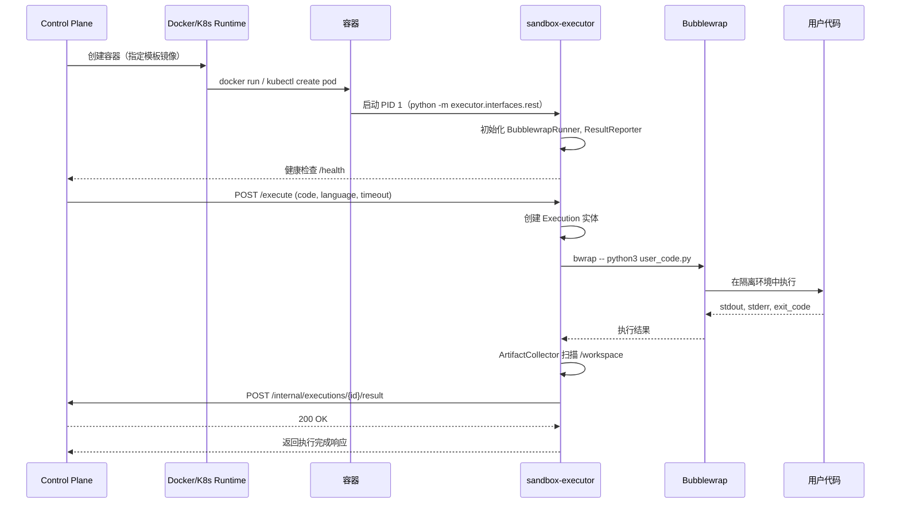

# 沙箱平台 - 六边形架构项目结构

## 架构概述

本项目采用**六边形架构**（Hexagonal Architecture / Ports and Adapters），也称为洋葱架构。

### 核心原则

1. **向内依赖原则**：依赖关系始终指向圆心（核心领域）
2. **外部可替换**：数据库、API、消息队列等外部组件可随时替换
3. **业务逻辑独立**：核心业务逻辑不依赖任何框架或基础设施

## 项目目录结构

```
sandbox/
├── sandbox_control_plane/         # 管理中心（六边形架构）
│   ├── src/                       # 源代码根目录
│   │   ├── domain/                # 领域层（核心）
│   │   │   ├── __init__.py
│   │   │   ├── entities/          # 实体（聚合根）
│   │   │   │   ├── __init__.py
│   │   │   │   ├── session.py     # 会话实体
│   │   │   │   ├── execution.py   # 执行实体
│   │   │   │   └── template.py    # 模板实体
│   │   │   ├── value_objects/     # 值对象
│   │   │   │   ├── __init__.py
│   │   │   │   ├── resource_limit.py
│   │   │   │   ├── execution_status.py
│   │   │   │   └── artifact.py
│   │   │   ├── repositories/      # 仓储接口（Port）
│   │   │   │   ├── __init__.py
│   │   │   │   ├── session_repository.py
│   │   │   │   ├── execution_repository.py
│   │   │   │   └── template_repository.py
│   │   │   ├── services/          # 领域服务
│   │   │   │   ├── __init__.py
│   │   │   │   ├── scheduler.py   # 调度领域服务
│   │   │   │   └── retry_policy.py
│   │   │   └── events/            # 领域事件
│   │   │       ├── __init__.py
│   │   │       ├── events.py
│   │   │       └── handlers.py
│   │
│   ├── application/              # 应用层（用例编排）
│   │   ├── __init__.py
│   │   ├── commands/             # 命令（写操作）
│   │   │   ├── __init__.py
│   │   │   ├── create_session.py
│   │   │   ├── execute_code.py
│   │   │   ├── terminate_session.py
│   │   │   └── cleanup_sessions.py
│   │   ├── queries/              # 查询（读操作）
│   │   │   ├── __init__.py
│   │   │   ├── get_session.py
│   │   │   ├── get_execution.py
│   │   │   └── list_templates.py
│   │   ├── dtos/                 # 数据传输对象
│   │   │   ├── __init__.py
│   │   │   ├── session_dto.py
│   │   │   ├── execution_dto.py
│   │   │   └── template_dto.py
│   │   ├── services/             # 应用服务（用例编排）
│   │   │   ├── __init__.py
│   │   │   ├── session_service.py
│   │   │   └── execution_service.py
│   │   └── handlers/             # 命令/查询处理器
│   │       ├── __init__.py
│   │       ├── command_handlers.py
│   │       └── query_handlers.py
│   │
│   ├── infrastructure/           # 基础设施层（Adapter）
│   │   ├── __init__.py
│   │   ├── persistence/          # 持久化适配器
│   │   │   ├── __init__.py
│   │   │   ├── models/           # ORM 模型
│   │   │   │   ├── __init__.py
│   │   │   │   ├── session_model.py
│   │   │   │   └── execution_model.py
│   │   │   ├── repositories/     # 仓储实现
│   │   │   │   ├── __init__.py
│   │   │   │   ├── sql_session_repository.py
│   │   │   │   └── sql_execution_repository.py
│   │   │   └── database.py       # 数据库连接管理
│   │   ├── messaging/            # 消息适配器
│   │   │   ├── __init__.py
│   │   │   ├── kafka_publisher.py
│   │   │   └── redis_publisher.py
│   │   ├── external/             # 外部服务适配器
│   │   │   ├── __init__.py
│   │   │   ├── runtime/          # 运行时适配器
│   │   │   │   ├── __init__.py
│   │   │   │   ├── docker_runtime.py
│   │   │   │   ├── k8s_runtime.py
│   │   │   │   └── runtime_client.py
│   │   │   ├── storage/          # 存储适配器
│   │   │   │   ├── __init__.py
│   │   │   │   ├── s3_storage.py
│   │   │   │   └── local_storage.py
│   │   │   └── http/             # HTTP 客户端
│   │   │       ├── __init__.py
│   │   │       └── http_client.py
│   │   ├── logging/              # 日志适配器
│   │   │   ├── __init__.py
│   │   │   ├── structured_logger.py
│   │   │   └── middleware.py
│   │   └── config/               # 配置管理
│   │       ├── __init__.py
│   │       ├── settings.py
│   │       └── dependencies.py
│   │
│   ├── interfaces/               # 接口层（Adapter）
│   │   ├── __init__.py
│   │   ├── rest/                 # REST API 适配器
│   │   │   ├── __init__.py
│   │   │   ├── api/              # 路由定义
│   │   │   │   ├── __init__.py
│   │   │   │   ├── v1/
│   │   │   │   │   ├── __init__.py
│   │   │   │   │   ├── sessions.py
│   │   │   │   │   ├── executions.py
│   │   │   │   │   └── templates.py
│   │   │   │   └── internal/     # 内部 API
│   │   │   │       └── callbacks.py
│   │   │   ├── schemas/          # Pydantic 模型
│   │   │   │   ├── __init__.py
│   │   │   │   ├── request.py
│   │   │   │   └── response.py
│   │   │   ├── middlewares/      # FastAPI 中间件
│   │   │   │   ├── __init__.py
│   │   │   │   ├── auth.py
│   │   │   │   ├── error_handler.py
│   │   │   │   └── rate_limit.py
│   │   │   └── dependencies.py   # FastAPI 依赖注入
│   │   ├── cli/                  # CLI 适配器
│   │   │   ├── __init__.py
│   │   │   └── commands.py
│   │   ├── grpc/                 # gRPC 适配器（可选）
│   │   │   └── __init__.py
│   │   └── websocket/            # WebSocket 适配器（可选）
│   │       └── __init__.py
│   │
│   └── shared/                   # 共享模块
│       ├── __init__.py
│       ├── errors/               # 错误定义
│       │   ├── __init__.py
│       │   ├── domain.py         # 领域错误
│       │   └── infrastructure.py # 基础设施错误
│       ├── constants/            # 常量定义
│       │   ├── __init__.py
│       │   └── status.py
│       ├── utils/                # 工具函数
│       │   ├── __init__.py
│       │   ├── id_generator.py
│       │   └── datetime_utils.py
│       └── validators/           # 验证器
│           ├── __init__.py
│           └── session_validators.py
│
├── tests/                        # 测试目录
│   ├── unit/                     # 单元测试
│   │   ├── domain/               # 领域层测试
│   │   ├── application/          # 应用层测试
│   │   ├── infrastructure/       # 基础设施层测试
│   │   └── interfaces/           # 接口层测试
│   ├── integration/              # 集成测试
│   │   ├── api/                  # API 集成测试
│   │   ├── database/             # 数据库集成测试
│   │   └── messaging/            # 消息集成测试
│   └── fixtures/                 # 测试夹具
│       ├── data/                 # 测试数据
│       └── factories/            # 工厂函数
│
├── scripts/                      # 脚本目录
│   ├── init_db.py                # 数据库初始化
│   ├── migrate.py                # 数据库迁移
│   └── seed_data.py              # 种子数据
│
├── pyproject.toml                # 项目配置
├── alembic.ini                   # Alembic 配置
├── Dockerfile                    # Control Plane Docker 镜像
├── .env.example                  # 环境变量示例
├── .gitignore
└── README.md
│
├── deploy/                       # 部署配置
│   └── k8s/                      # Kubernetes manifests
│       ├── 00-namespace.yaml
│       ├── 01-configmap.yaml
│       └── ...
│
├── docker-compose.yml            # 开发环境
├── runtime/                      # 运行时模块
│   ├── executor/                 # 执行器（容器内守护进程）
│   │   │
│   │   ├── domain/               # 领域层（核心）
│   │   │   ├── __init__.py
│   │   │   ├── entities.py       # Execution 实体（状态机）
│   │   │   ├── value_objects.py  # 值对象（ExecutionResult, Artifact, HeartbeatSignal等）
│   │   │   ├── services.py       # 领域服务（ArtifactCollector）
│   │   │   └── ports/            # 领域端口（Port 接口）
│   │   │       ├── __init__.py
│   │   │       ├── executor_port.py           # IExecutorPort
│   │   │       ├── callback_port.py           # ICallbackPort
│   │   │       ├── isolation_port.py          # IIsolationPort
│   │   │       ├── artifact_scanner_port.py   # IArtifactScannerPort
│   │   │       ├── heartbeat_port.py          # IHeartbeatPort
│   │   │       └── lifecycle_port.py          # ILifecyclePort
│   │   │
│   │   ├── application/          # 应用层（用例编排）
│   │   │   ├── __init__.py
│   │   │   ├── commands/         # 命令处理器
│   │   │   │   ├── __init__.py
│   │   │   │   └── execute_code.py # ExecuteCodeCommand（主用例）
│   │   │   ├── services/         # 应用服务
│   │   │   │   ├── __init__.py
│   │   │   │   ├── executor_service.py     # ExecutorService
│   │   │   │   ├── heartbeat_service.py    # HeartbeatService（实现IHeartbeatPort）
│   │   │   │   └── lifecycle_service.py    # LifecycleService（实现ILifecyclePort）
│   │   │   └── dto/             # 数据传输对象
│   │   │       ├── __init__.py
│   │   │       └── execute_request.py
│   │   │
│   │   ├── infrastructure/       # 基础设施层（Adapter 实现）
│   │   │   ├── __init__.py
│   │   │   ├── isolation/        # 进程隔离适配器
│   │   │   │   ├── __init__.py
│   │   │   │   ├── bwrap.py               # BubblewrapRunner（实现IIsolationPort）
│   │   │   │   ├── code_wrapper.py        # Python代码包装器
│   │   │   │   └── result_parser.py       # 返回值解析器
│   │   │   ├── http/             # HTTP通信适配器
│   │   │   │   ├── __init__.py
│   │   │   │   └── callback_client.py      # CallbackClient（实现ICallbackPort）
│   │   │   ├── persistence/      # 持久化适配器
│   │   │   │   ├── __init__.py
│   │   │   │   └── artifact_scanner.py    # ArtifactScanner（实现IArtifactScannerPort）
│   │   │   ├── monitoring/       # 监控适配器
│   │   │   │   ├── __init__.py
│   │   │   │   └── metrics.py              # MetricsCollector
│   │   │   ├── config/           # 配置管理
│   │   │   │   ├── __init__.py
│   │   │   │   └── config.py               # Settings
│   │   │   ├── logging/          # 日志适配器
│   │   │   │   ├── __init__.py
│   │   │   │   └── logging_config.py       # Structured logging
│   │   │   ├── result_reporter.py # ResultReporter（遗留，待重构）
│   │   │   └── bwrap.py           # 遗留文件（已迁移至isolation/）
│   │   │
│   │   ├── interfaces/           # 接口层（Driving Adapter）
│   │   │   ├── __init__.py
│   │   │   └── http/             # HTTP接口
│   │   │       ├── __init__.py
│   │   │       └── rest.py       # FastAPI应用（容器入口）
│   │   │
│   │   ├── tests/                # 测试目录
│   │   │   ├── unit/             # 单元测试
│   │   │   │   ├── domain/       # 领域层测试
│   │   │   │   │   ├── test_entities.py
│   │   │   │   │   ├── test_value_objects.py
│   │   │   │   │   └── test_ports.py
│   │   │   │   ├── application/  # 应用层测试
│   │   │   │   │   └── test_services.py
│   │   │   │   └── infrastructure/ # 基础设施层测试
│   │   │   ├── contract/         # 契约测试
│   │   │   └── integration/      # 集成测试
│   │   │
│   │   ├── pyproject.toml        # 执行器模块配置
│   │   ├── requirements.txt      # Python依赖
│   │   ├── Dockerfile            # 执行器Docker镜像
│   │   └── README.md             # 执行器文档
│   │
│   ├── docker_runtime.py         # Docker运行时适配器
│   └── k8s_runtime.py            # Kubernetes运行时适配器
│
├── images/                       # 镜像定义
│   ├── base/                     # 基础镜像
│   │   └── Dockerfile            # sandbox-base（执行器 + Bubblewrap）
│   │
│   └── templates/                # 模板镜像（继承基础镜像）
│       ├── python-basic/         # Python 基础环境
│       │   └── Dockerfile
│       ├── python-datascience/   # Python 数据科学环境
│       │   └── Dockerfile
│       └── nodejs-basic/         # Node.js 基础环境
│           └── Dockerfile
│
└── docs/                         # 项目文档
    ├── PROJECT_STRUCTURE.md      # 本文档
    └── sandbox-design-v2.1.md    # 技术设计文档
```

## 依赖流向图

```
┌─────────────────────────────────────────────────────────────┐
│                      Interfaces Layer                        │
│  ┌──────────┐  ┌──────────┐  ┌──────────┐  ┌──────────┐   │
│  │   REST   │  │   CLI    │  │   gRPC   │  │ WebSocket │   │
│  │   API    │  │          │  │          │  │          │   │
│  └────┬─────┘  └────┬─────┘  └────┬─────┘  └────┬─────┘   │
│       │             │             │             │           │
│       └─────────────┴─────────────┴─────────────┘           │
│                             │                                │
└─────────────────────────────┼───────────────────────────────┘
                              │
                              ▼
┌─────────────────────────────────────────────────────────────┐
│                    Application Layer                        │
│  ┌──────────┐  ┌──────────┐  ┌──────────┐                  │
│  │ Commands │  │  Queries │  │  DTOs    │                  │
│  └────┬─────┘  └────┬─────┘  └──────────┘                  │
│       │             │                                        │
│       └─────────────┴─────────────┐                        │
│                                 │                          │
│  ┌────────────────────────────────▼──────────────────────┐ │
│  │              Application Services (Use Cases)         │ │
│  └───────────────────────────────────────────────────────┘ │
└─────────────────────────────┼───────────────────────────────┘
                              │
                              ▼
┌─────────────────────────────────────────────────────────────┐
│                      Domain Layer (Core)                    │
│  ┌────────────┐  ┌────────────┐  ┌────────────┐            │
│  │  Entities  │  │Value Objects││Repositories │            │
│  │            │  │             │ │ (Ports)    │            │
│  └────────────┘  └────────────┘  └──────┬─────┘            │
│  ┌────────────┐  ┌────────────┐        │                   │
│  │   Events   │  │  Domain    │        │                   │
│  │            │  │  Services  │        │                   │
│  └────────────┘  └────────────┘        │                   │
└────────────────────────────────────────┼───────────────────┘
                                         │
                              ┌──────────▼──────────┐
                              │   Ports (Interfaces)│
                              └─────────────────────┘
                                         │
┌────────────────────────────────────────┼────────────────────┐
│                    Infrastructure Layer (Adapters)          │
│  ┌─────────────┐  ┌─────────────┐  ┌─────────────┐        │
│  │  Database   │  │   Storage   │  │   Runtime   │        │
│  │  Adapter    │  │   Adapter   │  │   Adapter   │        │
│  └─────────────┘  └─────────────┘  └─────────────┘        │
│  ┌─────────────┐  ┌─────────────┐                          │
│  │  Messaging  │  │    HTTP     │                          │
│  │  Adapter    │  │   Adapter   │                          │
│  └─────────────┘  └─────────────┘                          │
└────────────────────────────────────────────────────────────┘
```

## 各层职责说明

### 1. Domain Layer (领域层)

**职责**：封装核心业务逻辑，完全独立，不依赖任何框架。

- **Entities（实体）**: 具有唯一标识的领域对象，如 Session、Execution
- **Value Objects（值对象）**: 不可变的值类型，如 ResourceLimit、Artifact
- **Repositories（仓储接口）**: 定义数据访问接口（Port）
- **Domain Services（领域服务）**: 复杂业务逻辑
- **Events（领域事件）**: 领域内发生的事件

### 2. Application Layer (应用层)

**职责**：编排用例，协调领域对象完成业务功能。

- **Commands（命令）**: 写操作的请求
- **Queries（查询）**: 读操作的请求
- **DTOs**: 数据传输对象
- **Application Services**: 用例编排
- **Handlers**: 命令/查询处理器

### 3. Infrastructure Layer (基础设施层)

**职责**：提供技术实现，实现领域层定义的接口（Adapter）。

- **Persistence**: 数据库持久化
- **Messaging**: 消息队列
- **External**: 外部服务集成
- **Logging**: 日志记录
- **Config**: 配置管理

### 4. Interfaces Layer (接口层)

**职责**：与外部世界交互，处理请求/响应。

- **REST API**: HTTP 接口
- **CLI**: 命令行接口
- **gRPC**: RPC 接口（可选）
- **WebSocket**: 实时通信（可选）

## 编码规范

### 命名约定

| 类型 | 命名约定 | 示例 |
|------|----------|------|
| Entity | 名词 | `Session`, `Execution` |
| Value Object | 名词 | `ResourceLimit`, `Artifact` |
| Repository Interface | `I` + 名词 + `Repository` | `ISessionRepository` |
| Repository Impl | 名词 + `Repository` + Impl | `SqlSessionRepository` |
| Command | 动词 + 名词 + `Command` | `CreateSessionCommand` |
| Query | 动词 + 名词 + `Query` | `GetSessionQuery` |
| Handler | 动词 + 名词 + `Handler` | `CreateSessionHandler` |
| Service | 名词 + `Service` | `SessionService` |

### 依赖规则

```python
# ✅ 正确：基础设施层依赖领域层（实现接口）
from src.domain.repositories import ISessionRepository

class SqlSessionRepository(ISessionRepository):
    ...

# ❌ 错误：领域层依赖基础设施层
from src.infrastructure.persistence.models import SessionModel

class Session:
    ...
```

## 示例代码结构

### 领域实体示例

```python
# src/domain/entities/session.py
from dataclasses import dataclass
from datetime import datetime
from src.domain.value_objects.resource_limit import ResourceLimit
from src.domain.value_objects.execution_status import SessionStatus

@dataclass
class Session:
    id: str
    template_id: str
    status: SessionStatus
    resource_limit: ResourceLimit
    workspace_path: str
    created_at: datetime
    last_activity_at: datetime

    def mark_as_terminated(self) -> None:
        """终止会话"""
        self.status = SessionStatus.TERMINATED
```

### 仓储接口示例

```python
# src/domain/repositories/session_repository.py
from abc import ABC, abstractmethod
from src.domain.entities.session import Session

class ISessionRepository(ABC):
    @abstractmethod
    async def save(self, session: Session) -> None:
        pass

    @abstractmethod
    async def find_by_id(self, session_id: str) -> Session | None:
        pass

    @abstractmethod
    async def find_idle_sessions(self, idle_threshold: datetime) -> list[Session]:
        pass
```

### 应用服务示例

```python
# src/application/services/session_service.py
from src.domain.repositories.session_repository import ISessionRepository
from src.domain.entities.session import Session
from src.application.commands.create_session import CreateSessionCommand

class SessionService:
    def __init__(self, session_repo: ISessionRepository):
        self._session_repo = session_repo

    async def create_session(self, command: CreateSessionCommand) -> Session:
        # 业务逻辑编排
        session = Session(
            id=self._generate_id(),
            template_id=command.template_id,
            ...
        )
        await self._session_repo.save(session)
        return session
```

### REST API 示例

```python
# src/interfaces/rest/api/v1/sessions.py
from fastapi import APIRouter, Depends
from src.application.services.session_service import SessionService
from src.interfaces.rest.schemas.request import CreateSessionRequest

router = APIRouter()

@router.post("/sessions")
async def create_session(
    request: CreateSessionRequest,
    service: SessionService = Depends()
):
    command = CreateSessionCommand(**request.dict())
    session = await service.create_session(command)
    return SessionResponse.from_entity(session)
```

## 测试策略

### 单元测试

- **Domain**: 测试实体行为、领域服务逻辑
- **Application**: 测试用例编排（使用 Mock Repository）
- **Infrastructure**: 测试适配器实现（使用内存数据库）

### 集成测试

- **API**: 测试完整请求流程
- **Database**: 测试数据库交互（使用测试数据库）
- **Messaging**: 测试消息发布/订阅

## 迁移指南

如果现有项目需要迁移到六边形架构，建议按以下步骤：

1. **识别领域边界**：划分实体、值对象
2. **定义仓储接口**：在领域层定义数据访问接口
3. **移动业务逻辑**：将业务逻辑移到领域层
4. **实现适配器**：在基础设施层实现接口
5. **重构 API 层**：将 API 层改为薄层，仅处理 HTTP

## 参考资源

- [Hexagonal Architecture by Alistair Cockburn](https://alistair.cockburn.us/hexagonal-architecture/)
- [Clean Architecture by Robert C. Martin](https://blog.cleancoder.com/uncle-bob/2012/08/13/the-clean-architecture.html)
- [Domain-Driven Design by Eric Evans](https://www.domainlanguage.com/ddd/)

---

## 执行器架构详解

### 执行器角色

执行器（`sandbox-executor`）是运行在容器/Pod 内的守护进程，作为容器的 PID 1 主进程运行。它负责：

1. **HTTP 服务**：监听 8080 端口，接收来自 Control Plane 的执行请求
2. **Bubblewrap 隔离**：调用 bwrap 实现第二层进程隔离
3. **结果上报**：执行完成后通过回调 API 上报结果到 Control Plane
4. **制品收集**：扫描 workspace 目录，收集生成的文件

### 容器进程模型

```
┌─────────────────────────────────────────┐
│ 容器 / Pod                               │
│  ┌─────────────────────────────────────┐ │
│  │ PID 1: sandbox-executor (FastAPI)   │ │  ← 容器主进程
│  │  - 监听 0.0.0.0:8080                 │ │
│  │  - 接收 /execute POST 请求           │ │
│  │  - 调用 BubblewrapRunner             │ │
│  │  - 上报结果到 Control Plane          │ │
│  └─────────────────────────────────────┘ │
│           ↓ 调用 bwrap                   │
│  ┌─────────────────────────────────────┐ │
│  │ Bubblewrap 沙箱进程                 │ │  ← 用户代码
│  │  - python3 / node / bash            │ │
│  │  - 完全隔离的命名空间                │ │
│  │  - 只读文件系统 + /workspace 可写    │ │
│  └─────────────────────────────────────┘ │
│                                          │
│  /workspace (S3 Volume 或临时存储)       │
└─────────────────────────────────────────┘
```

### 执行器的六边形架构

执行器也采用六边形架构，与 Control Plane 保持一致。最新的架构引入了明确的 Port 接口定义：

```
┌─────────────────────────────────────────┐
│         Interfaces Layer                │
│  ┌────────────────────────────────────┐ │
│  │  FastAPI REST (port 8080)          │ │
│  │  - POST /execute                   │ │
│  │  - GET /health                     │ │
│  └────────────┬───────────────────────┘ │
└───────────────┼───────────────────────────┘
                │
                ▼
┌─────────────────────────────────────────┐
│       Application Layer                 │
│  ┌────────────────────────────────────┐ │
│  │  ExecuteCodeCommand (主用例)      │ │
│  │  - 协调执行流程                    │ │
│  │  - 处理超时、重试、错误            │ │
│  └────────────┬───────────────────────┘ │
│  ┌────────────────────────────────────┐ │
│  │  HeartbeatService                 │ │
│  │  LifecycleService                 │ │
│  └────────────────────────────────────┘ │
└───────────────┼───────────────────────────┘
                │
                ▼
┌─────────────────────────────────────────┐
│         Domain Layer (Core)             │
│  ┌──────────┐  ┌──────────────────────┐ │
│  │Execution │  │ArtifactCollector     │ │
│  │(Entity)  │  │(Domain Service)      │ │
│  └──────────┘  └──────────────────────┘ │
│  ┌────────────────────────────────────┐ │
│  │  Value Objects                    │ │
│  │  - ExecutionRequest, Result       │ │
│  │  - Artifact, HeartbeatSignal       │ │
│  │  - ContainerLifecycleEvent        │ │
│  └────────────────────────────────────┘ │
│  ┌────────────────────────────────────┐ │
│  │  Ports (Interfaces)                │ │
│  │  - IExecutorPort                   │ │
│  │  - ICallbackPort                   │ │
│  │  - IIsolationPort                  │ │
│  │  - IArtifactScannerPort            │ │
│  │  - IHeartbeatPort                  │ │
│  │  - ILifecyclePort                  │ │
│  └────────────────────────────────────┘ │
└───────────────┬───────────────────────────┘
                │ Ports
                ▼
┌─────────────────────────────────────────┐
│      Infrastructure Layer (Adapters)    │
│  ┌─────────────────┐  ┌──────────────┐ │
│  │BubblewrapRunner │  │CallbackClient│ │
│  │(IIsolationPort) │  │(ICallbackPort)│ │
│  └─────────────────┘  └──────────────┘ │
│  ┌─────────────────┐  ┌──────────────┐ │
│  │ArtifactScanner  │  │HeartbeatSvc  │ │
│  │(IArtifactScanner│  │(IHeartbeatPort)│ │
│  │Port)           │  │              │ │
│  └─────────────────┘  └──────────────┘ │
│  ┌─────────────────┐  ┌──────────────┐ │
│  │LifecycleService │  │MetricsCollector│ │
│  │(ILifecyclePort) │  │              │ │
│  └─────────────────┘  └──────────────┘ │
└─────────────────────────────────────────┘
```

### 关键设计原则

1. **Port 与 Adapter 分离**
   - Port（端口）：在 domain/ports/ 中定义抽象接口
   - Adapter（适配器）：在 infrastructure/ 中实现具体技术
   - 依赖注入：Application 层依赖 Port 接口，不依赖具体实现

2. **不可变值对象**
   - 所有值对象使用 `@dataclass(frozen=True)` 确保不可变性
   - 在 `__post_init__` 中进行验证（如路径安全检查）

3. **依赖反转**
   - 高层模块（Application）不依赖低层模块（Infrastructure）
   - 两者都依赖抽象（Domain Ports）

### 镜像构建流程

```bash
# 1. 构建基础镜像（包含执行器 + Bubblewrap）
cd images/base
docker build -t sandbox-base:latest .

# 2. 构建模板镜像（继承基础镜像，添加语言依赖）
cd images/templates/python-datascience
docker build -t sandbox-python-datascience:v1.0.0 \
  --build-arg BASE_IMAGE=sandbox-base:latest .

# 或使用统一构建脚本
cd images
./build.sh --push --registry registry.example.com
```

### 执行器生命周期



### 关键设计决策

| 决策点 | 选择 | 理由 |
|--------|------|------|
| **进程模型** | 执行器 = PID 1 | 容器生命周期绑定，进程崩溃自动触发容器重启 |
| **通信协议** | HTTP (FastAPI) | 标准化、易调试、支持异步 |
| **隔离机制** | Bubblewrap | Linux 原生、无需额外守护进程、轻量级 |
| **结果上报** | 回调 API | 解耦执行器和结果存储，支持异步处理 |
| **镜像分层** | Base + Template | 复用基础层，减少构建时间和镜像大小 |

### 环境变量配置

执行器通过环境变量接收配置：

```bash
# 必需配置
WORKSPACE_PATH=/workspace                    # 工作目录路径
CONTROL_PLANE_URL=http://control-plane:8000  # Control Plane 地址

# 可选配置
EXECUTOR_HOST=0.0.0.0                        # 监听地址（默认：0.0.0.0）
EXECUTOR_PORT=8080                           # 监听端口（默认：8080）
INTERNAL_API_TOKEN=xxxx                      # 内部 API 认证令牌
LOG_LEVEL=INFO                               # 日志级别
```

### 与 Control Plane 的交互

执行器通过 **内部回调 API** 与 Control Plane 通信：

```
# Control Plane 提供的内部接口
POST /internal/executions/{execution_id}/result    # 上报执行结果
POST /internal/executions/{execution_id}/status    # 上报状态变更
POST /internal/executions/{execution_id}/heartbeat # 心跳保活
```

**安全说明**：
- 内部 API 应该仅在内网/容器网络中可访问
- 使用 API Token 或 mTLS 进行认证
- 限制仅运行时节点可访问

### 开发和测试

```bash
# 本地运行执行器（用于开发）
cd runtime/executor
export WORKSPACE_PATH=/tmp/workspace
export CONTROL_PLANE_URL=http://localhost:8000
PYTHONPATH=../runtime python -m executor.interfaces.http.rest

# 运行单元测试（按层级）
cd runtime/executor
pytest tests/unit/domain/ -v        # 领域层测试
pytest tests/unit/application/ -v   # 应用层测试
pytest tests/unit/infrastructure/ -v # 基础设施层测试

# 运行所有测试
pytest tests/ -v

# 运行特定标记的测试
pytest -m unit              # 仅单元测试
pytest -m integration       # 仅集成测试
pytest -m contract          # 仅契约测试

# 构建并测试容器镜像
docker build -t sandbox-executor:test -f runtime/executor/Dockerfile .
docker run -p 8080:8080 \
  -e WORKSPACE_PATH=/workspace \
  -e CONTROL_PLANE_URL=http://host.docker.internal:8000 \
  -v $(pwd)/test_workspace:/workspace \
  sandbox-executor:test
```

### 测试策略

执行器采用分层测试策略，遵循六边形架构原则：

#### 1. Domain 层测试（tests/unit/domain/）

- **test_entities.py**: 测试实体行为
  - Execution 状态转换
  - 生命周期管理
  - 重试计数

- **test_value_objects.py**: 测试值对象
  - 不可变性验证
  - 数据验证逻辑
  - 类型安全

- **test_ports.py**: 测试 Port 接口
  - 接口定义完整性
  - 抽象方法签名
  - 可实现性验证

#### 2. Application 层测试（tests/unit/application/）

- **test_services.py**: 测试应用服务
  - HeartbeatService 心跳管理
  - LifecycleService 生命周期处理
  - ExecuteCodeCommand 用例编排
  - 使用 Mock Port 进行隔离测试

#### 3. Infrastructure 层测试（tests/unit/infrastructure/）

- 测试 Adapter 实现
- 验证 Port 接口正确实现
- 使用 Fake/Mock 避免真实依赖

#### 4. 契约测试（tests/contract/）

- 验证各层之间的契约
- API 契约测试
- 数据格式验证

#### 5. 集成测试（tests/integration/）

- 端到端执行流程
- 真实 Bubblewrap 隔离
- HTTP 回调集成

### 测试示例

#### Domain 层测试示例

```python
# tests/unit/domain/test_entities.py
@pytest.mark.unit
def test_execution_state_transition():
    """测试 Execution 状态转换"""
    context = ExecutionContext(...)
    execution = Execution(...)

    # PENDING → RUNNING
    execution.mark_as_running()
    assert execution.status == ExecutionStatus.RUNNING

    # RUNNING → SUCCESS
    result = ExecutionResult(...)
    execution.mark_as_completed(result)
    assert execution.status == ExecutionStatus.SUCCESS
```

#### Application 层测试示例

```python
# tests/unit/application/test_services.py
@pytest.mark.asyncio
@pytest.mark.unit
async def test_heartbeat_service():
    """测试 HeartbeatService"""
    mock_callback = AsyncMock(spec=ICallbackPort)
    service = HeartbeatService(
        callback_port=mock_callback,
        interval=1.0,
    )

    await service.start_heartbeat("exec_001")
    await asyncio.sleep(2.5)

    # 应该至少发送2次心跳
    assert mock_callback.report_heartbeat.call_count >= 2

    await service.stop_heartbeat("exec_001")
```

### 迁移记录

#### 2025-01-07: 完成六边形架构迁移

**迁移范围**:
- 从 `executor/` 迁移到 `runtime/executor/`
- 引入 Port 接口定义（domain/ports/）
- 重构 Application 层为命令模式（application/commands/）
- 重组 Infrastructure 层为适配器模式

**新增组件**:
- `domain/ports/` - 6个Port接口定义
- `application/commands/` - 命令处理器
- `application/services/` - 应用服务（HeartbeatService, LifecycleService）
- `infrastructure/{config,http,isolation,logging,monitoring,persistence}/` - 适配器模块
- `tests/unit/domain/` - 领域层单元测试
- `tests/unit/application/` - 应用层单元测试

**清理**:
- 删除旧的 `executor/` 目录
- 移除 `services.py` 与 `services/` 目录冲突
- 更新所有导入为相对导入

**验证**:
- ✅ 所有模块导入成功
- ✅ 13个测试文件已迁移
- ✅ Dockerfile 配置已更新
- ✅ pyproject.toml 入口点已更新
