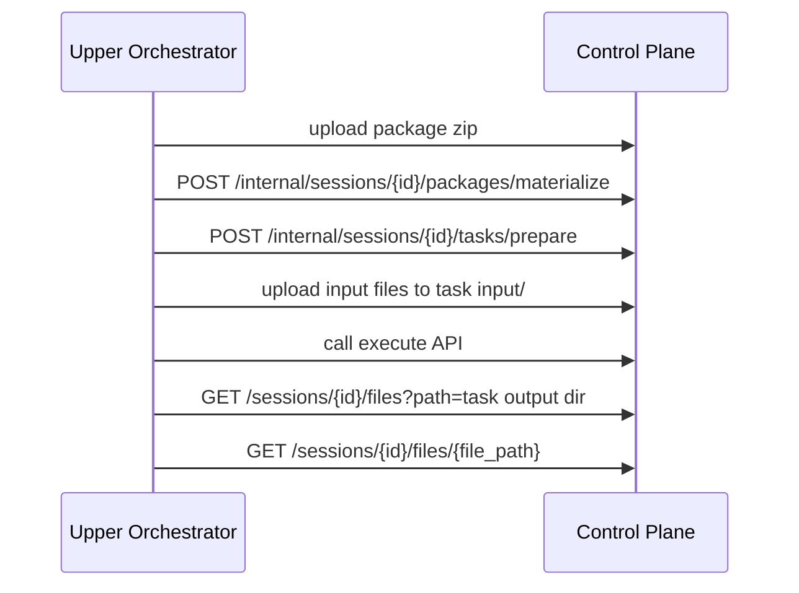

# Runtime Package 与 Task Workspace REST API

## 文档范围

本文档面向调用方，描述 `sandbox` 当前已经提供的三类 REST 接口：

- runtime package materialize
- task workspace prepare
- session workspace 文件 upload/list/download

本文不展开内部实现细节；设计背景见：

- [runtime-package-task-workspace-primitives.md](/Users/chenshu/Code/github.com/kweaver-ai/sandbox/docs/design/features/runtime-package-task-workspace-primitives.md)

## 接口概览

### Internal API

基于 `sandbox_control_plane`

- `POST /api/v1/internal/sessions/{session_id}/packages/materialize`
- `POST /api/v1/internal/sessions/{session_id}/tasks/prepare`

### Session 文件 API

基于 `sandbox_control_plane`

- `POST /api/v1/sessions/{session_id}/files/upload`
- `GET /api/v1/sessions/{session_id}/files`
- `GET /api/v1/sessions/{session_id}/files/{file_path:path}`

## 路径语义

这些接口的请求参数统一使用 workspace 相对路径，而不是宿主机绝对路径。

例如：

- `.packages/docx/v1/abc123.zip`
- `.runtime_packages/abc123`
- `.tasks/skill/docx_convert_001/input/source.docx`

但 `GET /api/v1/sessions/{session_id}/files` 返回的 `container_path` 例外，它是容器内绝对路径：

```text
/workspace/{relative_path}
```

如果上层拿到的是 internal API 返回的相对路径，需要自行映射为：

```text
/workspace/{relative_path}
```

## 1. materialize runtime package

### 请求

`POST /api/v1/internal/sessions/{session_id}/packages/materialize`

#### Path 参数

- `session_id`: session 标识

#### Body

```json
{
  "package_path": ".packages/docx/v1/abc123.zip",
  "package_hash": "abc123",
  "force": false
}
```

字段说明：

- `package_path`
  - workspace 内 zip 包相对路径
- `target_dir`
  - 可选；自定义解压目标目录
- `package_hash`
  - 可选；用于默认缓存目录命名和幂等判断
- `force`
  - 是否强制重新解压

### 响应

```json
{
  "session_id": "sess_001",
  "package_path": ".packages/docx/v1/abc123.zip",
  "target_dir": ".runtime_packages/abc123",
  "checksum": "abc123",
  "reused": true,
  "files_count": 8
}
```

字段说明：

- `target_dir`
  - package 解压后的根目录，相对于 workspace
- `checksum`
  - package hash
- `reused`
  - 是否命中已有缓存
- `files_count`
  - `package/` 下文件数

### 调用示例

```bash
curl -X POST "http://sandbox-control-plane:8000/api/v1/internal/sessions/sess_001/packages/materialize" \
  -H "Content-Type: application/json" \
  -d '{
    "package_path": ".packages/docx/v1/abc123.zip",
    "package_hash": "abc123",
    "force": false
  }'
```

## 2. prepare task workspace

### 请求

`POST /api/v1/internal/sessions/{session_id}/tasks/prepare`

#### Path 参数

- `session_id`: session 标识

#### Body

```json
{
  "task_id": "docx_convert_001",
  "task_type": "skill",
  "create_dirs": ["input", "output", "tmp", "logs"],
  "reset": true
}
```

字段说明：

- `task_id`
  - 本次任务/执行 ID
- `task_type`
  - 任务类型，默认 `skill`
- `create_dirs`
  - 需要创建的子目录
- `reset`
  - 如果 task 根目录已存在，是否先清空再创建

### 响应

```json
{
  "session_id": "sess_001",
  "task_id": "docx_convert_001",
  "task_root": ".tasks/skill/docx_convert_001",
  "directories": {
    "input": ".tasks/skill/docx_convert_001/input",
    "output": ".tasks/skill/docx_convert_001/output",
    "tmp": ".tasks/skill/docx_convert_001/tmp",
    "logs": ".tasks/skill/docx_convert_001/logs"
  },
  "existed": false
}
```

### 调用示例

```bash
curl -X POST "http://sandbox-control-plane:8000/api/v1/internal/sessions/sess_001/tasks/prepare" \
  -H "Content-Type: application/json" \
  -d '{
    "task_id": "docx_convert_001",
    "task_type": "skill",
    "create_dirs": ["input", "output", "tmp", "logs"],
    "reset": true
  }'
```

## 3. 上传 session 文件

### 请求

`POST /api/v1/sessions/{session_id}/files/upload?path={relative_path}`

#### Query 参数

- `path`
  - 文件在 workspace 中的目标相对路径

#### Form Data

- `file`
  - 上传文件内容

### 响应

```json
{
  "session_id": "sess_001",
  "file_path": ".tasks/skill/docx_convert_001/input/source.docx",
  "size": 10240
}
```

### 调用示例

```bash
curl -X POST "http://sandbox-control-plane:8000/api/v1/sessions/sess_001/files/upload?path=.tasks/skill/docx_convert_001/input/source.docx" \
  -F "file=@source.docx"
```

## 4. 列出 session 文件

### 请求

`GET /api/v1/sessions/{session_id}/files`

#### Query 参数

- `path`
  - 可选；指定目录路径
- `limit`
  - 可选；最大返回文件数

### 响应

```json
{
  "session_id": "sess_001",
  "files": [
    {
      "name": ".tasks/skill/docx_convert_001/output/result.pdf",
      "container_path": "/workspace/.tasks/skill/docx_convert_001/output/result.pdf",
      "size": 20480,
      "modified_time": "2026-04-04T12:00:00Z",
      "etag": "etag-demo"
    }
  ],
  "count": 1
}
```

### 调用示例

```bash
curl "http://sandbox-control-plane:8000/api/v1/sessions/sess_001/files?path=.tasks/skill/docx_convert_001/output&limit=100"
```

## 5. 下载 session 文件

### 请求

`GET /api/v1/sessions/{session_id}/files/{file_path:path}`

### 返回

当前可能有两种返回：

1. 二进制文件流
2. JSON：

```json
{
  "session_id": "sess_001",
  "file_path": ".tasks/skill/docx_convert_001/output/result.pdf",
  "presigned_url": "https://...",
  "size": 20480
}
```

### 调用示例

```bash
curl -L "http://sandbox-control-plane:8000/api/v1/sessions/sess_001/files/.tasks/skill/docx_convert_001/output/result.pdf" -o result.pdf
```

## 典型调用链



## 常见错误

- `400 Path escapes workspace`
  - 传入的 `package_path`、`target_dir`、`path` 或 task 相关路径越界
- `400 Package does not exist`
  - `package_path` 指向的 zip 在 session workspace 中不存在
- `404 file not found`
  - 下载或列出的目标文件不存在

## 调用建议

- package 上传后优先传 `package_hash`，这样便于 executor 复用缓存
- task 执行前统一调用 `tasks/prepare(reset=true)`，避免旧结果污染
- 输出回收优先先 list 再 download，不要假设某个文件一定存在
