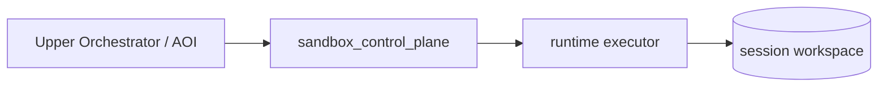
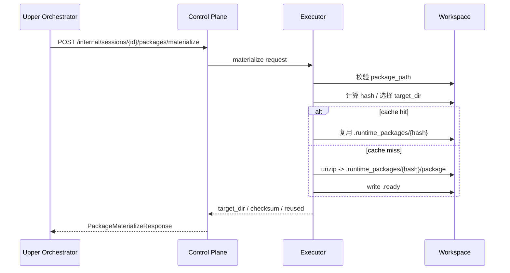
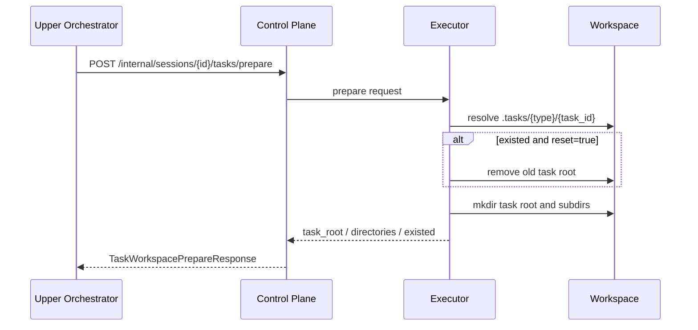

# Runtime Package 与 Task Workspace 原语设计

## 文档信息

- Status: Draft
- Owner:
- Last Updated: 2026-04-04

## 设计目标

本文档只描述当前 `sandbox` 已经实现的三类原语：

- runtime package materialize
- task workspace prepare
- session workspace 文件下载

本文不讨论：

- 上层 AOI 的 skill/runtime profile 设计
- artifact 中台或统一资源引用模型
- package 依赖环境隔离的长期规划

## 术语说明

### runtime package

中文可理解为“运行时包”或“运行包”。

这里的 package 不是 Python package 或 npm package，而是指：

- 上层系统准备好的 zip 文件
- 里面包含脚本、配置、引用资源等完整运行物料
- executor 不理解其中业务语义，只负责把它解压成可执行目录

之所以叫 `runtime package`，是因为它服务于“运行时装配”，不是“注册时元数据管理”。

### materialize

中文建议理解为“装配”或“实体化”。

这里不用“解压”作为接口名，是因为当前行为不只是 unzip：

1. 校验 package 路径
2. 计算或复用 hash
3. 选择缓存目录
4. 判断是否复用已有结果
5. 必要时才真正解压
6. 写入 `.ready` 标记

所以 `materialize` 表达的是：

- 把一个“逻辑 package 引用”
- 转成 executor 本地 workspace 中可直接运行的实体目录

### task workspace

中文可理解为“任务工作区”。

它表示一次任务执行的私有目录，不是整个 session 的公共 workspace。

之所以叫 `task workspace`，是因为它的职责是：

- 给一次执行提供隔离的 `input/output/tmp/logs`
- 避免不同任务共享同一个目录
- 让 package 目录和执行产物目录分离

### primitive

这里翻成“原语”。

意思不是完整业务流程，而是给上层编排系统使用的最小基础能力。

`packages/materialize` 和 `tasks/prepare` 都属于这种类型：

- 语义单一
- 输入输出明确
- 可被上层多次组合
- 不关心具体 skill、agent 或业务域

## 方案概览

当前 `sandbox` 在 Skill 场景下承担的是“运行时底座”角色，不理解 Skill 业务语义，只提供以下能力：

1. 在 session workspace 中缓存并解压 zip package
2. 在 session workspace 中准备隔离的 task 工作目录
3. 提供文件 upload/list/download 原语，供上层编排服务装配输入和回收输出

核心原则：

- package 是只读运行物料，默认落在 `.runtime_packages/{package_hash}`
- task 是一次执行的私有工作目录，默认落在 `.tasks/{task_type}/{task_id}`
- executor 只关心 workspace 内相对路径，不关心 skill_id、entrypoint 等业务概念
- session file API 的请求参数使用 workspace 相对路径，但 `list_files` 返回的 `container_path` 是容器内绝对路径 `/workspace/{relative_path}`

## 路径语义

这组原语同时涉及两类路径，不能混用：

- workspace 相对路径
  - 例如 `.packages/docx/v1/abc123.zip`
  - 用于 `package_path`、`target_dir`、`path`、`file_path` 等请求参数
- 容器内绝对路径
  - 例如 `/workspace/.tasks/skill/docx_convert_001/output/result.pdf`
  - 这是 `list_files` 返回的 `container_path`
  - 主要用于上层 runtime 或 agent 在容器内继续执行命令时引用

`list_files` 返回中：

- `name`：文件的 workspace 相对路径
- `container_path`：文件在容器内的绝对路径

## 服务边界

### sandbox_control_plane

职责：

- 暴露 internal API
- 根据 session 定位对应 executor
- 将 package/task 请求转发给 executor
- 暴露 session workspace 的文件 upload/list/download 接口

### runtime/executor

职责：

- 在本地挂载的 workspace 中真正执行 package 解压和 task 目录准备
- 做路径越界保护
- 返回标准化的相对路径结果

## 当前接口

### 控制面 internal API

- `POST /api/v1/internal/sessions/{session_id}/packages/materialize`
- `POST /api/v1/internal/sessions/{session_id}/tasks/prepare`

### 控制面 session 文件 API

- `POST /api/v1/sessions/{session_id}/files/upload`
- `GET /api/v1/sessions/{session_id}/files`
- `GET /api/v1/sessions/{session_id}/files/{file_path:path}`

## 调用总览



## 详细设计

### 1. package materialize

#### 请求模型

`PackageMaterializeRequest`

- `package_path`: session workspace 内 zip 包相对路径
- `target_dir`: 可选，指定解压目标目录
- `package_hash`: 可选，默认由 executor 对 zip 计算 SHA256
- `force`: 是否强制重新解压

#### 请求示例

```json
{
  "package_path": ".packages/docx/v1/abc123.zip",
  "package_hash": "abc123",
  "force": false
}
```

#### executor 行为

1. 基于 `WORKSPACE_PATH` 解析本地 workspace 根目录
2. 校验 `package_path` 不得越界
3. 计算 `package_hash`
4. 生成默认目录 `.runtime_packages/{package_hash}`
5. 若 `.ready` 存在且 `package/` 存在，并且未指定 `force=true`，则直接复用
6. 否则清理旧目录并将 zip 解压到：

```text
.runtime_packages/{package_hash}/package/
```

7. 在目标目录写入 `.ready`

#### 响应模型

`PackageMaterializeResponse`

- `session_id`
- `package_path`
- `target_dir`
- `checksum`
- `reused`
- `files_count`

#### 响应示例

```json
{
  "session_id": "sess_001",
  "package_path": ".packages/docx/v1/abc123.zip",
  "target_dir": ".runtime_packages/abc123",
  "checksum": "abc123",
  "reused": true,
  "files_count": 8
}
```

#### 时序



### 2. task workspace prepare

#### 请求模型

`TaskWorkspacePrepareRequest`

- `task_id`
- `task_type`，默认 `skill`
- `create_dirs`，默认 `input/output/tmp/logs`
- `reset`

#### 请求示例

```json
{
  "task_id": "docx_convert_001",
  "task_type": "skill",
  "create_dirs": ["input", "output", "tmp", "logs"],
  "reset": true
}
```

#### executor 行为

1. 生成 task 根目录：

```text
.tasks/{task_type}/{task_id}
```

2. 若目录已存在且 `reset=true`，则先删除后重建
3. 创建请求中声明的所有子目录
4. 返回 task 根目录和各子目录相对 workspace 的路径

#### 响应模型

`TaskWorkspacePrepareResponse`

- `session_id`
- `task_id`
- `task_root`
- `directories`
- `existed`

#### 响应示例

```json
{
  "session_id": "sess_001",
  "task_id": "docx_convert_001",
  "task_root": ".tasks/skill/docx_convert_001",
  "directories": {
    "input": ".tasks/skill/docx_convert_001/input",
    "output": ".tasks/skill/docx_convert_001/output",
    "tmp": ".tasks/skill/docx_convert_001/tmp",
    "logs": ".tasks/skill/docx_convert_001/logs"
  },
  "existed": false
}
```

#### 时序



### 3. session workspace 文件下载

控制面已经支持：

- 上传：`POST /sessions/{session_id}/files/upload`
- 列表：`GET /sessions/{session_id}/files`
- 下载：`GET /sessions/{session_id}/files/{file_path:path}`

当前下载接口行为：

- 如果底层返回 presigned URL，则返回 JSON
- 否则直接返回文件字节流

这个能力用于上层编排服务：

- 执行前上传输入文件到 task `input/`
- 执行后列出 `output/`
- 对单文件输出做下载回收
- `list_files` 返回的 `name` 是 workspace 相对路径，`container_path` 是容器内绝对路径

#### 下载示例

```text
GET /api/v1/sessions/{session_id}/files/.tasks/skill/docx_convert_001/output/result.pdf
```

可能返回：

- 二进制文件流
- 或带 `presigned_url` 的 JSON

## 路径语义

当前实现里：

- internal API 返回 workspace 相对路径，而不是宿主机绝对路径
- session file API 的请求参数使用 workspace 相对路径
- `GET /sessions/{session_id}/files` 返回的 `container_path` 是容器内绝对路径 `/workspace/{relative_path}`

例如：

- package target: `.runtime_packages/{hash}`
- task root: `.tasks/skill/{task_id}`
- output dir: `.tasks/skill/{task_id}/output`
- session file `container_path`: `/workspace/.tasks/skill/{task_id}/output/result.pdf`

对于 internal API 返回的相对路径，上层系统如果需要容器内路径，应自行映射为：

```text
/workspace/{relative_path}
```

例如：

- `.runtime_packages/abc123/package/scripts/convert.py`
  对应容器内路径 `/workspace/.runtime_packages/abc123/package/scripts/convert.py`
- `.tasks/skill/docx_convert_001/output/result.pdf`
  对应容器内路径 `/workspace/.tasks/skill/docx_convert_001/output/result.pdf`

## 安全约束

executor 侧通过 `_resolve_relative_path()` 做路径保护：

- 所有传入路径都必须位于 workspace 根目录下
- 任何 `../` 越界路径都会被拒绝

这意味着：

- `package_path` 不能逃出 workspace
- `target_dir` 不能逃出 workspace
- `task_id + create_dirs` 展开的目录也不能逃出 workspace

## 当前已知边界

- package materialize 只负责解压 zip，不处理运行时依赖
- task workspace prepare 只负责目录隔离，不处理业务语义
- 下载接口目前主要面向单文件回收；目录型输出仍需要上层自行遍历
- `.runtime_packages/{hash}` 的生命周期目前依赖 session 生命周期，不做全局缓存治理

## 测试与验证

当前相关测试主要覆盖：

- `sandbox_control_plane` 对 executor client 的转发
- executor 内部的 package materialize 和 task prepare 行为

推荐最少回归点：

1. 同一 hash 二次 materialize 返回 `reused=true`
2. `force=true` 时强制重新解压
3. `reset=true` 时 task 目录被重建
4. 非法相对路径被拒绝
5. session 文件下载返回字节流或 presigned URL 的两种分支

## 风险与权衡

- 当前 package cache 是 session-local 的，跨 session 不共享
- task workspace 是最小隔离，尚未上升到 artifact/object 级抽象
- 文件下载接口是基础能力，但上层如何将其转换为平台级 artifact 仍由外层系统决定
