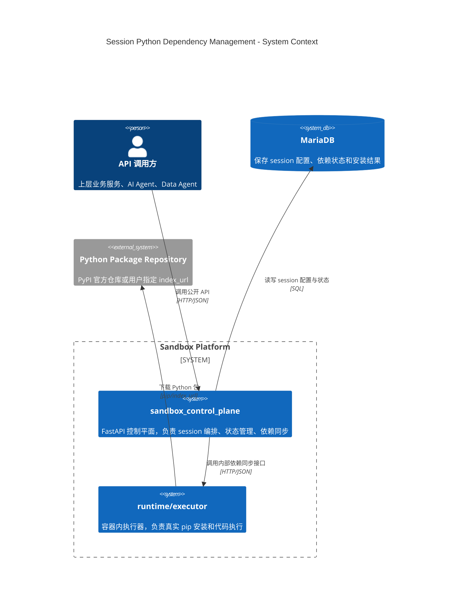
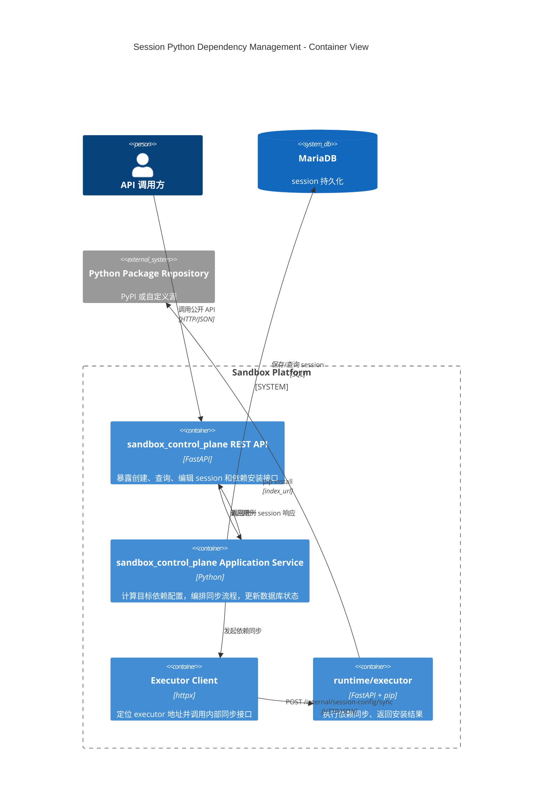
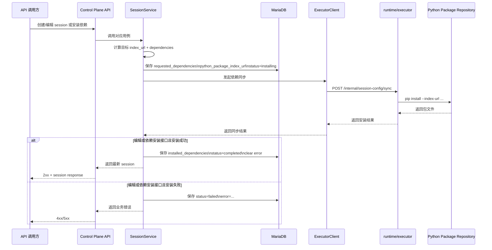

# Session Python 依赖管理实现设计

## 关联需求

- PRD: [Session Python 依赖管理 PRD](../../product/prd/session-python-dependency-management.md)

## 1. 文档目标

本文档定义 session Python 仓库源与依赖管理的落地方案，覆盖：

- API 变更
- 数据模型变更
- `sandbox_control_plane` 实现方案
- `runtime/executor` 实现方案
- 状态流转
- 错误处理
- 测试方案

基线参考：

- OpenAPI：`docs/api/rest/sandbox-openapi.json`
- 数据库：`migrations/mariadb/0.2.0/pre/init.sql`

## 2. 设计结论

### 2.1 总体方案

采用“control plane 持久化目标配置，再调用 executor 执行同步安装”的单一主路径。

关键原则：

- session 的 Python 仓库源与依赖列表属于 session 配置的一部分，必须存库。
- executor 是唯一真实安装执行方。
- control plane 是唯一编排方，负责触发 executor 同步并更新安装状态。
- 编辑 session 与独立依赖安装接口共享同一套依赖同步服务。

### 2.2 核心语义

- 创建 session：保存完整目标配置，并异步触发首次依赖同步安装；最终结果通过 session 查询观察。
- 编辑 session：
  - `dependencies` 使用全量替换语义
  - 依赖相关字段立即同步到 executor
  - 其他通用字段仅更新数据库
- 依赖安装接口：
  - `dependencies` 使用增量合并语义
  - 本质是“增量编辑 session 依赖配置并立即同步”
  - 接口同步返回本次安装结果

### 2.3 架构视图

本节只保留理解本需求所需的关键视图：

- C4 Context：看清谁在使用这套能力，以及 control plane 与 executor 的关系
- C4 Container：看清责任边界、数据落点和依赖同步主路径
- 关键时序图：看清创建/编辑/安装时的编排顺序

#### 2.3.1 C4 Context

这张图回答“谁和系统交互、系统边界在哪里”。



说明：

- 调用方只和 `sandbox_control_plane` 交互，不直接访问 executor。
- `sandbox_control_plane` 是依赖配置的事实来源。
- executor 只负责执行，不负责决定 session 的目标配置。

#### 2.3.2 C4 Container

这张图回答“系统内部有哪些容器/模块，各自职责是什么”。



说明：

- `REST API` 负责协议适配，不负责依赖合并和安装状态管理。
- `Application Service` 是本需求的核心编排层。
- `Executor Client` 复用现有 executor 通信能力，避免把依赖安装逻辑下沉到 scheduler。
- `runtime/executor` 是唯一真实安装执行方。

#### 2.3.3 关键时序图

这张图回答“请求进入后，配置保存和安装动作按什么顺序发生”。



说明：

- 先落库目标配置，再调用 executor，同步失败后不回滚目标配置。
- `requested_dependencies` 表示目标态，`installed_dependencies` 表示最近一次成功同步后的实际态。
- 创建、编辑、增量安装三种入口最终都收敛到同一条同步主路径。
- 创建 session 的首次依赖安装为异步链路，调用方通过后续 `GET /sessions/{id}` 查询最终结果。
- 独立依赖安装接口为同步链路，需要在当前请求中返回本次安装结果。

## 3. API 设计

## 3.1 Control Plane 对外 API

### 3.1.1 更新创建 session

`POST /api/v1/sessions`

新增请求字段：

```json
{
  "python_package_index_url": "https://pypi.org/simple/",
  "dependencies": [
    {"name": "requests", "version": "==2.31.0"}
  ]
}
```

请求规则：

- `python_package_index_url` 可选，默认 `https://pypi.org/simple/`
- `dependencies` 可为空数组

响应新增字段：

- `language_runtime`
- `python_package_index_url`
- `requested_dependencies`
- `installed_dependencies`
- `dependency_install_status`
- `dependency_install_error`
- `dependency_install_started_at`
- `dependency_install_completed_at`

查询接口返回要求：

- `GET /api/v1/sessions/{session_id}` 必须返回以上全部依赖相关字段
- `GET /api/v1/sessions` 的每个 session item 也必须返回以上全部依赖相关字段
- 列表查询与详情查询在依赖相关字段上保持一致，避免调用方维护两套 session 数据结构

创建接口响应语义：

- 创建接口返回 session 当前配置快照
- 若依赖安装尚未完成，`dependency_install_status` 可能为 `pending` 或 `installing`
- 创建接口不等待 executor 返回最终安装结果
- 调用方应通过 `GET /api/v1/sessions/{session_id}` 观察首次依赖安装的最终状态

### 3.1.2 新增编辑 session

`PATCH /api/v1/sessions/{session_id}`

请求体允许字段：

```json
{
  "cpu": "2",
  "memory": "1Gi",
  "disk": "5Gi",
  "timeout": 600,
  "env_vars": {"A": "B"},
  "python_package_index_url": "https://pypi.org/simple/",
  "dependencies": [
    {"name": "numpy", "version": "==2.0.0"}
  ]
}
```

行为：

- `dependencies` 出现时按全量替换处理
- `python_package_index_url` 出现时覆盖当前值
- 若本次请求涉及依赖字段，则触发 executor 同步
- 若本次请求仅涉及普通字段，则只更新数据库

### 3.1.3 新增依赖安装接口

`POST /api/v1/sessions/{session_id}/dependencies/install`

请求体：

```json
{
  "python_package_index_url": "https://pypi.org/simple/",
  "dependencies": [
    {"name": "pandas", "version": "==2.2.0"},
    {"name": "requests", "version": "==2.32.0"}
  ]
}
```

行为：

- `python_package_index_url` 可选，传入则覆盖当前 session 仓库配置
- `dependencies` 必填且至少一个
- 新依赖与 `requested_dependencies` 合并
- 同名包按请求值覆盖旧版本
- 合并后持久化为新的 `requested_dependencies`
- 随后触发 executor 同步安装

响应语义：

- 该接口为同步接口
- 只有在 executor 返回安装结果后才返回响应
- 成功时返回最新 session 以及本次安装结果
- 失败时返回错误，并将失败状态写回 session

## 3.2 Control Plane 到 Executor 内部 API

新增 executor 内部接口：

`POST /internal/session-config/sync`

请求体建议如下：

```json
{
  "session_id": "sess_xxx",
  "language_runtime": "python3.11",
  "python_package_index_url": "https://pypi.org/simple/",
  "dependencies": [
    "requests==2.31.0",
    "numpy==2.0.0"
  ],
  "sync_mode": "replace"
}
```

字段定义：

- `session_id`: session 标识
- `language_runtime`: 语言运行时类型，用于 executor 二次校验，取值示例 `python3.11`
- `python_package_index_url`: 本次安装使用的 index_url
- `dependencies`: pip spec 列表
- `sync_mode`:
  - `replace`
  - `merge`

说明：

- 这里显式使用 `language_runtime`，避免与 session 实体中表示底层运行平台的 `runtime_type` 混淆。
- 在当前项目中：
  - 模板层的 `runtime_type` 表示语言运行时，例如 `python3.11`
  - session 实体中的 `runtime_type` 实际表示底层运行平台，例如 `docker` 或 `kubernetes`
- 本接口做 Python 依赖同步时，关心的是语言运行时是否为 Python，而不是 session 跑在 Docker 还是 Kubernetes。
- 即便 control plane 已在合并逻辑中得到最终目标依赖列表，安装时 executor 仍统一接收最终列表。
- `sync_mode` 主要用于记录意图、日志和后续扩展；本期实际安装行为都基于最终目标列表执行。

返回体建议如下：

```json
{
  "status": "completed",
  "installed_dependencies": [
    {
      "name": "requests",
      "version": "2.31.0",
      "install_location": "/opt/sandbox-venv",
      "install_time": "2026-03-09T12:00:00Z",
      "is_from_template": false
    }
  ],
  "error": "",
  "started_at": "2026-03-09T12:00:00Z",
  "completed_at": "2026-03-09T12:00:10Z"
}
```

返回规则：

- 成功：HTTP 200
- 请求校验错误：HTTP 400
- 安装失败：HTTP 422 或 500，返回错误信息

## 4. 数据模型设计

## 4.1 数据库变更

表：`t_sandbox_session`

新增字段：

- `f_python_package_index_url` `varchar(512) NOT NULL`

默认值：

- `https://pypi.org/simple/`

现有字段沿用并统一语义：

- `f_requested_dependencies`: JSON 数组，保存目标 pip spec 列表
- `f_installed_dependencies`: JSON 数组，保存最近一次成功安装结果
- `f_dependency_install_status`: `pending/installing/completed/failed`
- `f_dependency_install_error`: 最近一次失败原因
- `f_dependency_install_started_at`: 最近一次安装开始毫秒时间戳
- `f_dependency_install_completed_at`: 最近一次安装结束毫秒时间戳

## 4.2 Domain 实体变更

`Session` 增加字段：

- `python_package_index_url: str`
- `dependency_install_started_at: datetime | None`
- `dependency_install_completed_at: datetime | None`

保留现有字段：

- `requested_dependencies`
- `installed_dependencies`
- `dependency_install_status`
- `dependency_install_error`

领域方法建议补充：

- `replace_requested_dependencies(index_url, dependencies)`
- `merge_requested_dependencies(index_url, dependencies)`
- `mark_dependency_installing(started_at)`
- `mark_dependency_install_completed(installed, completed_at)`
- `mark_dependency_install_failed(error, completed_at)`

## 4.3 DTO / Response 变更

需要同步扩展：

- Request schema
- Response schema
- Application DTO
- ORM model
- Repository save/load 映射

具体要求：

- `SessionDTO` 增加：
  - `language_runtime`
  - `python_package_index_url`
  - `requested_dependencies`
  - `installed_dependencies`
  - `dependency_install_status`
  - `dependency_install_error`
  - `dependency_install_started_at`
  - `dependency_install_completed_at`
- `SessionDTO.from_entity(...)` 必须完整映射上述字段
- `SessionResponse` 必须完整暴露上述字段
- `SessionListResponse.items[*]` 复用同一个 `SessionResponse`，因此列表接口不得裁剪这些字段
- 如果后续需要轻量列表响应，应新增独立 summary schema，而不是让当前列表接口返回不完整 session 信息

`SessionResponse` 增加字段：

- `language_runtime`
- `python_package_index_url`
- `requested_dependencies`
- `installed_dependencies`
- `dependency_install_status`
- `dependency_install_error`
- `dependency_install_started_at`
- `dependency_install_completed_at`

## 4.4 服务升级 - 数据库升级

本次需求除了定义 `0.3.0` 的全量初始化 SQL，还需要保证已有 `0.2.0` 环境可以在服务升级时自动补齐字段。

升级目标：

- 对新部署环境，直接使用 `migrations/mariadb/0.3.0/pre/init.sql` 或 `migrations/dm8/0.3.0/pre/init.sql`
- 对已存在的 `0.2.0` 数据库，在服务启动或数据库初始化阶段自动检测并补齐 `f_python_package_index_url`

### 4.4.1 升级策略

采用“全量初始化 SQL + 启动时幂等补列”的双轨方案：

1. 全量初始化 SQL
   - 新增 `migrations/mariadb/0.3.0/pre/init.sql`
   - 新增 `migrations/dm8/0.3.0/pre/init.sql`
   - 两份 SQL 整体基于 `0.2.0` 对应版本复制，并在 `t_sandbox_session` 中新增 `f_python_package_index_url`
2. 存量库自动升级
   - 服务启动或数据库初始化逻辑执行 schema check
   - 自动检测 `t_sandbox_session` 是否存在 `f_python_package_index_url`
   - 若不存在，则执行 `ALTER TABLE ... ADD COLUMN ...`
   - 若已存在，则跳过

### 4.4.2 自动检测要求

MariaDB 检测要求：

- 检查表：`t_sandbox_session`
- 检查字段：`f_python_package_index_url`
- 建议查询 `information_schema.COLUMNS`

DM8 检测要求：

- 检查表：`t_sandbox_session`
- 检查字段：`f_python_package_index_url`
- 建议查询 DM8 系统目录，如 `USER_TAB_COLUMNS` 或等价元数据视图

### 4.4.3 补列行为

如果字段不存在，则创建：

- 字段名：`f_python_package_index_url`
- 类型：
  - MariaDB: `varchar(512) NOT NULL`
  - DM8: `VARCHAR(512 CHAR) NOT NULL`
- 默认值：`https://pypi.org/simple/`

补列 SQL 设计要求：

- 必须幂等，多次执行不会失败
- 对已有数据行应补齐默认值
- 不要求删除或重建现有表
- 不修改现有索引结构

### 4.4.4 服务行为要求

服务升级时的数据库处理流程建议如下：

1. 启动数据库连接
2. 检查当前数据库类型
3. 查询 `t_sandbox_session` 列定义
4. 若缺少 `f_python_package_index_url`，执行补列
5. 记录升级日志
6. 继续正常启动

日志建议包含：

- 数据库类型
- 目标表名
- 检测结果
- 是否执行补列
- 补列成功或失败原因

### 4.4.5 初始化 SQL 要求

新增文件：

- `migrations/mariadb/0.3.0/pre/init.sql`
- `migrations/dm8/0.3.0/pre/init.sql`

内容要求：

- 整体复制各自 `0.2.0/pre/init.sql`
- 版本号更新为 `0.3.0`
- 在 `t_sandbox_session` 定义中新增 `f_python_package_index_url`
- 对 DM8 版本同时补充字段注释

## 5. Control Plane 设计

## 5.1 新增/更新应用服务

在 `SessionService` 中新增：

- `update_session(...)`
- `install_session_dependencies(...)`

同时抽出统一私有方法：

- `_sync_session_dependencies(...)`

该方法负责：

1. 校验 session 存在
2. 校验 session 为 Python runtime
3. 校验 session 状态可同步
4. 将目标配置写入 session
5. 将状态更新为 `installing`
6. 保存到仓储
7. 调 executor 内部同步接口
8. 根据返回更新成功或失败状态
9. 再次保存

## 5.2 创建 session 流程调整

当前实现中，依赖安装逻辑部分耦合在 scheduler 启动脚本。

本期调整为：

1. 创建 session 并保存基础记录
2. 创建容器 / Pod
3. 等待 executor ready
4. 先向调用方返回创建成功的 session 响应
5. control plane 在后台调 executor 内部同步接口执行首次依赖安装
6. 更新 session 依赖安装状态

收敛原则：

- 启动脚本不再作为依赖安装主路径
- 如保留兼容逻辑，也只能作为过渡，不再承担状态事实来源
- 首次依赖安装结果统一通过 session 查询接口暴露，而不是由创建接口同步承载

## 5.3 编辑 session 流程

### 5.3.1 仅普通字段更新

如果请求仅修改：

- `cpu`
- `memory`
- `disk`
- `timeout`
- `env_vars`

则：

1. 更新 session 配置
2. 保存数据库
3. 返回最新 session

本期不在线更新容器或 Pod。

### 5.3.2 涉及依赖字段更新

如果请求包含：

- `python_package_index_url`
- `dependencies`

则：

1. 先应用普通字段更新
2. 对依赖字段执行全量替换
3. 调 `_sync_session_dependencies(sync_mode=\"replace\")`
4. 返回最新 session 或错误

## 5.4 增量依赖安装流程

`install_session_dependencies(...)` 流程：

1. 读取 session
2. 将请求中的 `python_package_index_url` 覆盖当前值
3. 将请求 dependencies 转换为 pip spec
4. 与 `requested_dependencies` 合并
5. 按包名去重
6. 同名包保留最新请求版本
7. 将合并结果写回 `requested_dependencies`
8. 调 `_sync_session_dependencies(sync_mode=\"merge\")`

该流程为同步流程：

- service 需等待 executor 返回安装结果
- 成功后直接返回最新 session
- 失败时直接向上抛出错误响应

## 5.5 Executor Client 扩展

`ExecutorClient` 新增方法：

- `sync_session_config(...)`

请求目标：

- Docker: `http://{container_name}:{executor_port}/internal/session-config/sync`
- K8s: `http://{pod_ip}:{executor_port}/internal/session-config/sync`

需要新增 DTO：

- `ExecutorSyncSessionConfigRequest`
- `ExecutorSyncSessionConfigResponse`

## 5.6 Scheduler 设计

当前 scheduler 已能定位 executor 地址并提交 `/execute` 请求。

本期扩展：

- Docker/K8s scheduler service 复用现有 executor URL 发现能力
- 对依赖同步不新增新的 scheduler port，优先由 `ExecutorClient` 承担内部 HTTP 通信

这样可以避免把“安装依赖”错误放入容器调度职责。

## 6. Executor 设计

## 6.1 新增内部 HTTP 接口

在 `runtime/executor/interfaces/http/rest.py` 新增：

- `POST /internal/session-config/sync`

该接口不面向外部用户，仅供 control plane 调用。

## 6.2 新增应用服务

新增依赖同步服务，例如：

- `SessionConfigSyncService`

职责：

- 校验请求
- 构建 pip 安装命令
- 清理旧安装目录
- 执行安装
- 扫描实际安装结果
- 返回结构化结果

## 6.3 安装行为

本期安装目录固定：

- `/opt/sandbox-venv`

安装命令基线：

```bash
pip3 install \
  --target /opt/sandbox-venv \
  --disable-pip-version-check \
  --no-warn-script-location \
  --index-url <python_package_index_url> \
  <dependencies...>
```

安装前处理：

- 清理旧 `/opt/sandbox-venv`
- 重新创建目录
- 创建临时缓存目录

安装后处理：

- 扫描已安装包
- 生成 `installed_dependencies`
- 清理缓存

说明：

- 即使 `sync_mode=merge`，executor 仍按最终目标依赖列表执行一次完整安装，避免环境残留。
- 这可以确保 session 目标配置与实际环境收敛一致。

## 6.4 Executor 返回结果

返回内容包括：

- 最终状态
- 实际安装依赖列表
- 错误信息
- 开始时间
- 完成时间

若安装失败：

- 返回非 2xx 状态码
- 错误信息保留 pip stderr 关键摘要

## 7. 状态流转设计

## 7.1 成功流转

1. Control plane 更新目标配置
2. `dependency_install_status = installing`
3. 调用 executor 同步
4. executor 安装成功
5. `dependency_install_status = completed`
6. 更新 `installed_dependencies`
7. 清空 `dependency_install_error`

## 7.2 失败流转

1. Control plane 更新目标配置
2. `dependency_install_status = installing`
3. 调用 executor 同步
4. executor 安装失败 / 不可达
5. `dependency_install_status = failed`
6. 保留 `requested_dependencies` 和 `python_package_index_url` 新值
7. 更新 `dependency_install_error`

## 8. 并发与幂等

## 8.1 幂等原则

- 相同 session、相同目标配置的重复同步请求允许重复执行。
- executor 以最终目标依赖列表为准，因此多次调用结果应一致。

## 8.2 并发控制

建议在 control plane 应用层增加 session 级串行约束：

- 当 `dependency_install_status=installing` 时，新的依赖同步请求应拒绝，返回冲突错误。

原因：

- 避免两个并发安装请求交错覆盖 `requested_dependencies`
- 避免 `/opt/sandbox-venv` 被并发清理

## 9. 错误处理

## 9.1 错误分类

- `400 Bad Request`
  - 请求参数非法
  - 仓库 URL 非法
  - dependencies 为空或格式错误
- `404 Not Found`
  - session 不存在
- `409 Conflict`
  - 当前已有安装任务进行中
- `422 Unprocessable Entity`
  - 非 Python runtime
  - session 状态不允许同步
  - pip 安装失败
- `503 Service Unavailable`
  - executor 不可达

## 9.2 错误记录

`dependency_install_error` 记录简明错误摘要，不直接存储无限长 stderr。

建议策略：

- 保留首个高价值错误片段
- 最大长度做截断

## 10. OpenAPI 与文档更新

需要更新或新增以下内容：

- `docs/api/rest/sandbox-openapi.json`
  - 更新 `CreateSessionRequest`
  - 新增 `UpdateSessionRequest`
  - 新增 `InstallSessionDependenciesRequest`
  - 更新 `SessionResponse`
  - 因 `SessionListResponse.items` 复用 `SessionResponse`，列表查询返回结构会自动包含依赖相关字段
  - 增加 `PATCH /api/v1/sessions/{session_id}`
  - 增加 `POST /api/v1/sessions/{session_id}/dependencies/install`
- executor 文档：
  - 新增内部同步接口说明

## 11. 测试设计

## 11.1 Control Plane 单元测试

- 创建 session 时默认仓库源写入
- 创建 session 时自定义仓库源写入
- 编辑 session 仅更新普通字段
- 编辑 session 全量替换依赖
- 安装接口增量合并依赖
- 相同包名版本覆盖
- session 不存在
- 非 Python runtime 拒绝
- `installing` 状态下拒绝并发请求
- executor 失败时状态落库正确

## 11.2 Control Plane 集成测试

- 创建 session 后完成首次依赖同步
- PATCH session 触发 replace 同步
- 安装接口触发 merge 同步
- 查询 session 返回新增字段

## 11.3 Executor 单元测试

- 请求模型校验
- 默认 index_url 与自定义 index_url
- 清理旧安装目录
- pip 命令构建正确
- 安装成功结果解析
- 安装失败错误返回

## 11.4 端到端测试

- 创建 session 安装 `requests` 并执行 import
- 编辑 session 将依赖替换为 `numpy` 后执行 import
- 增量安装 `pandas` 后执行 import
- 错误源地址导致安装失败

## 12. 实施顺序

建议按以下顺序实施：

1. 扩展数据库与 ORM 映射
2. 扩展 domain / DTO / request / response 模型
3. 扩展 `ExecutorClient` 和 executor 内部接口
4. 实现 control plane 的创建、编辑、增量安装用例
5. 收敛或替换现有启动脚本依赖安装主路径
6. 更新 OpenAPI 文档
7. 补齐单元、集成、端到端测试

## 13. 已选默认值与假设

- 默认 Python 仓库源：`https://pypi.org/simple/`
- 本期仅支持单一 `index_url`
- `PATCH /sessions/{session_id}` 为通用更新接口，但只有依赖字段要求即时同步
- 依赖安装失败时保留新目标配置，不做数据库回滚
- 依赖安装接口使用增量合并语义
- 编辑接口对 `dependencies` 使用全量替换语义
