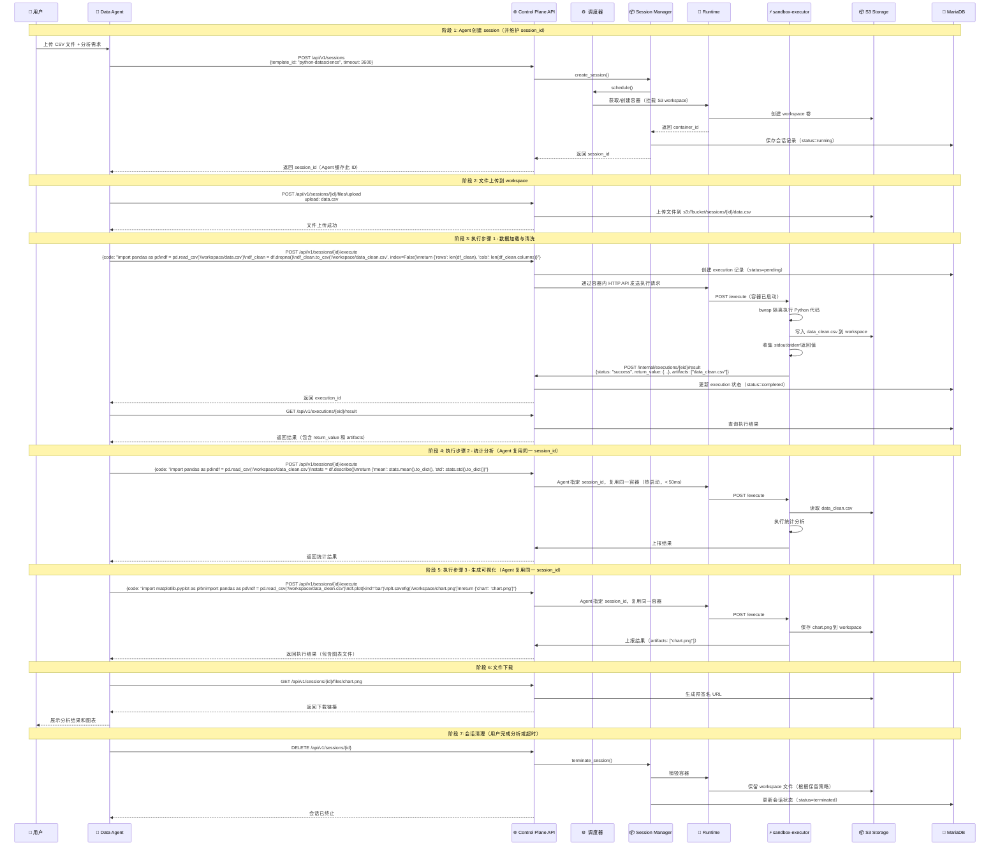
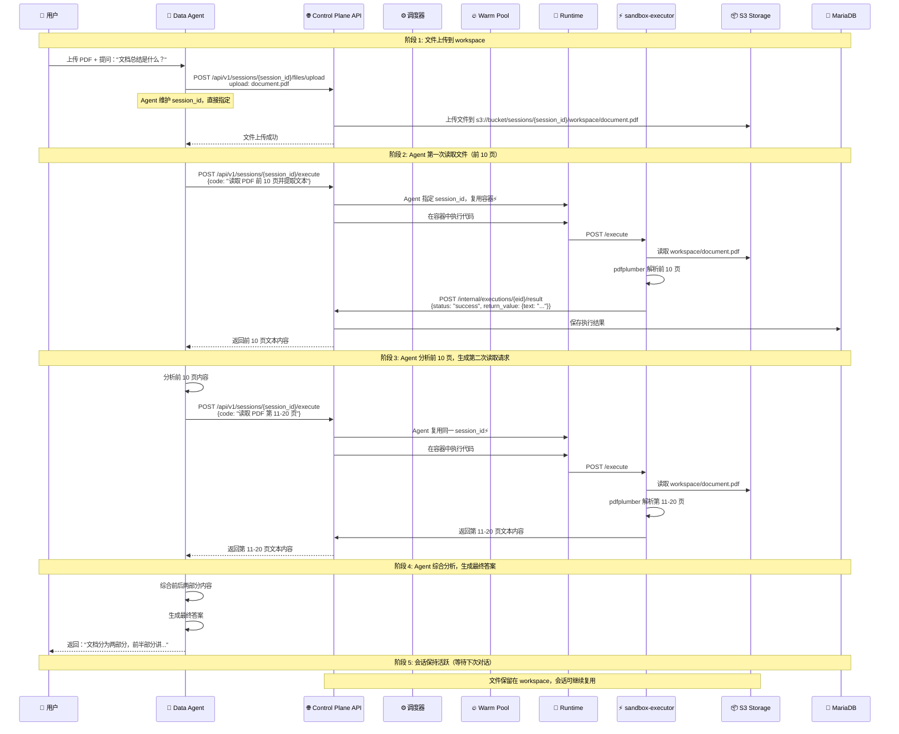

# 沙箱平台端到端集成方案
## 基于 PTC 数据分析与上下文问答的统一临时区场景

**版本**: v1.0
**日期**: 2025-01-05
**状态**: 设计验证

---

## 1. 文档概述

### 1.1 目的

本文档基于 `sandbox-design-v1.md` 第 1.4 节定义的**面向 PTC 数据分析 + 上下文问答的统一沙箱临时区**业务场景，结合 `sandbox-design-v2.1.md` 的完整技术设计方案，进行端到端场景验证，并形成完整的集成实施指南。

### 1.2 核心场景定义

沙箱平台需同时支持两类文件处理需求：

| 场景类型 | PTC 数据分析场景 | 非 PTC 问答场景 |
|---------|-----------------|----------------|
| **核心定义** | **Agent 生成代码** → 沙箱执行 → 结果返回 Agent → 继续推理 | **Agent 上传文件** → 沙箱存储 → Agent 多轮读取分析 → 推理 |
| **触发方式** | Agent 通过**程序化工具调用**（PTC）自动生成并提交代码 | Agent 调用文件上传工具 → 后续调用代码读取文件 |
| **执行模式** | Python 代码执行（pandas, numpy） | 文件解析 + 内容抽取 |
| **交互循环** | **多轮迭代**：Agent 反复生成代码、执行、分析结果、再生成新代码 | **多轮读取**：Agent 上传后，可多次调用代码读取不同部分 |
| **隔离要求** | 高隔离沙箱环境（防止生成代码逃逸） | 安全解析中间层 |
| **文件持久化** | 需要中间结果持久化（支持多步骤分析） | 需要文件持久化（多轮对话中重复读取） |
| **网络需求** | 可能需要外部数据（API 调用） | 默认无网络 |
| **会话模型** | 统一会话（基于 Agent ID 复用） | 统一会话（基于 Agent ID 复用） |

**场景一：PTC 数据分析 - Agent 代码生成与执行循环**

```
┌─────────────────────────────────────────────────────────────────┐
│                    PTC (Programmatic Tool Call)                 │
│                    Agent 代码生成与执行循环                      │
├─────────────────────────────────────────────────────────────────┤
│                                                                  │
│  ┌────────────────┐         ┌────────────────┐                 │
│  │  🤖 Agent      │         │  🛡️ 沙箱       │                 │
│  │  (LLM 推理)    │         │  (代码执行)    │                 │
│  └────────┬───────┘         └────────┬───────┘                 │
│           │                          │                          │
│    ① 生成代码                   ② 执行代码                      │
│    "读取CSV,统计均值"            "pandas计算"                   │
│           │                          │                          │
│           ├─────────────────────────>│                          │
│           │                          │                          │
│           │                    ③ 返回结果                        │
│           │<─────────────────────────┤                          │
│           │                          │                          │
│      ④ 分析结果                                                      │
│    "均值是 42.5，需要可视化"                                     │
│           │                          │                          │
│    ⑤ 生成新代码                  ⑥ 执行新代码                    │
│    "用matplotlib画图"            "生成图表"                       │
│           │                          │                          │
│           ├─────────────────────────>│                          │
│           │                          │                          │
│           │                    ⑦ 返回图表                        │
│           │<─────────────────────────┤                          │
│           │                          │                          │
│      ⑧ 最终推理                                                      │
│    "数据呈正态分布"                                               │
│           │                          │                          │
│           ▼                          ▼                          │
│      ┌─────────┐              ┌──────────┐                      │
│      │ 返回用户 │              │会话保持  │                      │
│      │ 答案    │              │（可复用） │                      │
│      └─────────┘              └──────────┘                      │
│                                                                  │
└─────────────────────────────────────────────────────────────────┘

**关键特征**：
1. Agent 自主生成代码（非人工编写）
2. 沙箱作为"工具"被 Agent 调用
3. 执行结果反馈给 Agent 用于下一步推理
4. 形成闭环：生成 → 执行 → 分析 → 再生成
5. 会话保持活跃，支持多轮迭代
```

**场景二：非 PTC 问答 - Agent 文件上传与多轮读取**

```
┌─────────────────────────────────────────────────────────────────┐
│                    非 PTC 问答：文件多轮读取                       │
├─────────────────────────────────────────────────────────────────┤
│                                                                  │
│  ┌────────────────┐         ┌────────────────┐                 │
│  │  👤 用户       │         │  🤖 Agent      │                 │
│  │  上传文件      │         │  (LLM 推理)    │                 │
│  └────────┬───────┘         └────────┬───────┘                 │
│           │                          │                          │
│           │ ① 上传 PDF               │                          │
│           ├─────────────────────────>│                          │
│           │                          │                          │
│           │                    ② 调用文件上传工具                  │
│           │                          │                          │
│           │           ┌───────────────┼───────────────┐          │
│           │           │               │               │          │
│           │           ▼               ▼               ▼          │
│           │      ┌─────────┐    ┌─────────┐    ┌─────────┐       │
│           │      │ 🛡️ 沙箱  │    │ 🛡️ 沙箱  │    │ 🛡️ 沙箱  │       │
│           │      │ 存储文件 │    │ 读取    │    │ 读取    │       │
│           │      │到workspace│   │第1-10页 │   │第11-20页│       │
│           │      └─────────┘    └─────────┘    └─────────┘       │
│           │           │               │               │          │
│           │           │ ③ 文件已上传  │ ④ 返回前10页   │ ⑤ 返回后10页│
│           │           │<──────────────┼───────────────┼──────────┤
│           │                          │               │          │
│           │                    ⑥ 分析前10页     ⑦ 分析后10页    │
│           │                          │               │          │
│           │<─────────────────────────┴───────────────┴──────────┤
│           │                                                          │
│           │ ⑧ 综合回答："文档分为两部分，前半部分讲..."              │
│           │<───────────────────────────────────────────────────│
│           │                                                          │
│      ┌─────┴─────┐                                                │
│      │  展示答案  │                                                │
│      └───────────┘                                                │
│                                                                  │
│  **关键特征**：                                                    │
│  1. 文件一次性上传到沙箱 workspace                                 │
│  2. Agent 可多次调用代码读取同一文件的不同部分                       │
│  3. 每次读取结果返回给 Agent 进行推理                              │
│  4. 支持多轮对话中反复引用同一文件                                  │
│  5. 会话保持活跃，文件持续可访问                                    │
│                                                                  │
└─────────────────────────────────────────────────────────────────┘
```

### 1.3 API 设计：异步 vs 同步

**核心问题**：v2.1 设计中代码执行是异步的（返回 execution_id 后需要轮询结果），这对 Agent 调用是否友好？

#### 1.3.1 当前异步 API 模式

```python
# v2.1 设计的异步 API 模式
POST /api/v1/sessions/{id}/execute
Request: {code: "...", language: "python"}
Response: {"execution_id": "exec_123", "status": "submitted"}

# Agent 需要轮询结果
GET /api/v1/executions/exec_123/result
# 反复调用直到 status == "completed"
```

**对 Agent 的影响**：
- ❌ 需要实现轮询逻辑（增加复杂度）
- ❌ 多次网络往返（增加延迟）
- ❌ 需要处理超时和错误重试
- ✅ 支持长时间执行（不阻塞 HTTP 连接）
- ✅ 可并发提交多个任务

#### 1.3.2 同步 API（工具层封装）

**方案**：在工具层做封装，实现阻塞等待，对 Agent 提供同步接口：

```python
# 工具层封装：同步等待结果
async def execute_code_sync(session_id: str, code: str, timeout: int = 300):
    """同步执行代码，工具层封装异步轮询"""

    # 1. 提交执行任务
    response = await http_client.post(
        f"{SANDBOX_API}/api/v1/sessions/{session_id}/execute",
        json={"code": code, "language": "python"}
    )
    execution_id = response.json()["execution_id"]

    # 2. 轮询等待结果（工具层处理）
    start_time = time.time()
    while True:
        result_response = await http_client.get(
            f"{SANDBOX_API}/api/v1/executions/{execution_id}/result"
        )
        result = result_response.json()

        if result["status"] in ["completed", "failed", "timeout"]:
            return result  # 直接返回结果

        # 超时检查
        if time.time() - start_time > timeout:
            raise TimeoutError(f"Execution timeout after {timeout}s")

        # 退避轮询
        await asyncio.sleep(0.5)

# Agent 调用（同步语义）
result = await execute_code_sync(
    session_id="sess_123",
    code="import pandas as pd\ndf = pd.read_csv('/workspace/data.csv')\nreturn df.describe()",
    timeout=60
)
print(result["return_value"])  # 直接使用结果
```

**优势**：
- ✅ Agent 调用简单，类似函数调用
- ✅ 工具层统一处理轮询、超时、错误
- ✅ 降低 Agent 集成复杂度

**劣势**：
- ⚠️ 长时间执行会阻塞（但可通过超时控制）
- ⚠️ 并发执行需要多个工具调用实例

#### 1.3.3 混合模式：推荐方案

```python
class SandboxTool:
    """沙箱工具：同时支持同步和异步接口"""

    async def execute_sync(self, code: str, timeout: int = 300):
        """同步接口：阻塞等待结果（适合大多数场景）"""
        execution_id = await self._submit(code)
        return await self._wait_for_result(execution_id, timeout)

    async def execute_async(self, code: str):
        """异步接口：立即返回 execution_id（适合长时间任务）"""
        execution_id = await self._submit(code)
        return {
            "execution_id": execution_id,
            "status": "submitted",
            "poll_url": f"/api/v1/executions/{execution_id}/result"
        }

    async def get_result(self, execution_id: str):
        """查询结果：配合异步接口使用"""
        return await http_client.get(
            f"{SANDBOX_API}/api/v1/executions/{execution_id}/result"
        )
```

**推荐使用策略**：

| 场景 | 推荐接口 | 原因 |
|------|---------|------|
| PTC 数据分析（大多数情况） | `execute_sync()` | 执行时间短（< 30s），阻塞等待更简单 |
| PTC 数据分析（长时间任务） | `execute_async()` | 执行时间长（> 30s），避免超时 |
| 非 PTC 文件解析 | `execute_sync()` | 单次解析，时间可控 |
| 批量并发任务 | `execute_async()` + 并发轮询 | 提高吞吐量 |

#### 1.3.4 API 设计总结

| 层级 | 接口类型 | 返回模式 | 适用场景 |
|------|---------|---------|---------|
| **沙箱平台 API** | 异步 | 立即返回 execution_id | 长时间任务、高并发 |
| **工具层封装** | 同步（默认） | 阻塞等待结果 | 短时间任务、简单集成 |
| **工具层封装** | 异步（可选） | 立即返回 execution_id | 长时间任务、高级用户 |

**建议**：
1. **沙箱平台保持异步 API**：性能最优，灵活性最高
2. **工具层提供同步封装**：降低 Agent 集成门槛
3. **文档强调同步接口**：大多数用户使用同步模式

---

### 1.4 设计目标

验证 v2.1 架构能否满足以下核心需求：

1. **统一临时区能力**：同一沙箱实例既能执行 Python 代码，又能解析各类文件格式
2. **统一会话模型**：基于 Agent ID 的会话复用，支持 PTC 和问答场景
3. **文件处理流程**：支持文件上传、解析、结果返回的完整链路
4. **Agent 友好 API**：工具层提供同步封装，简化 Agent 集成
5. **智能调度**：Agent 亲和性调度，优先复用已有会话
6. **资源隔离与安全**：双层隔离机制确保不逃逸
7. **性能要求**：冷启动 < 5s，热启动 < 100ms，执行响应 < 500ms

---

## 2. 架构映射

### 2.1 场景到架构的映射

```
┌─────────────────────────────────────────────────────────────────┐
│                      统一沙箱临时区（业务视图）                    │
├─────────────────────────────────────────────────────────────────┤
│                                                                  │
│  ┌──────────────────┐         ┌──────────────────┐             │
│  │ PTC 数据分析     │         │ 非 PTC 问答      │             │
│  │ - Python 执行    │         │ - 文件解析       │             │
│  │ - pandas/numpy   │         │ - PDF/OCR/CSV    │             │
│  │ - Agent 复用 session     │         │ - Agent 复用 session     │             │
│  └────────┬─────────┘         └────────┬─────────┘             │
│           │                            │                        │
│           └───────────┬────────────────┘                        │
│                       ▼                                         │
│           ┌───────────────────────┐                            │
│           │   统一沙箱临时区       │                            │
│           │ - 文件持久化          │                            │
│           │ - 复杂依赖兼容        │                            │
│           └───────────┬───────────┘                            │
└───────────────────────┼───────────────────────────────────────┘
                        │
                        ▼
┌─────────────────────────────────────────────────────────────────┐
│                    v2.1 技术架构（实现视图）                      │
├─────────────────────────────────────────────────────────────────┤
│                                                                  │
│  ┌─────────────────────────────────────────────────────────┐   │
│  │              Control Plane（管理中心）                    │   │
│  │  ┌──────────┐  ┌──────────┐  ┌──────────┐  ┌────────┐  │   │
│  │  │ API GW   │  │Scheduler │  │Session   │  │Template│  │   │
│  │  │          │  │          │  │Manager   │  │Manager │  │   │
│  │  └──────────┘  └──────────┘  └──────────┘  └────────┘  │   │
│  └──────────────────────────┬──────────────────────────────┘   │
│                             │                                   │
│  ┌──────────────────────────▼──────────────────────────────┐   │
│  │              Runtime Pool（运行时池）                     │   │
│  │  ┌────────────────┐         ┌────────────────┐          │   │
│  │  │ Warm Pool      │         │ Active Runtime │          │   │
│  │  │ - 预热实例     │         │ - 执行中容器   │          │   │
│  │  └────────────────┘         └────────────────┘          │   │
│  └──────────────────────────┬──────────────────────────────┘   │
│                             │                                   │
│  ┌──────────────────────────▼──────────────────────────────┐   │
│  │              Container（容器实例）                        │   │
│  │  ┌──────────────────────────────────────────────┐       │   │
│  │  │         sandbox-executor（HTTP 守护进程）     │       │   │
│  │  └──────────────────┬───────────────────────────┘       │   │
│  │                     │ Bubblewrap                        │   │
│  │  ┌──────────────────▼───────────────────────────┐       │   │
│  │  │         User Code Process（用户代码进程）      │       │   │
│  │  │  - PTC: Python pandas/numpy                  │       │   │
│  │  │  - 问答: PDF/OCR/CSV 解析器                  │       │   │
│  │  └──────────────────────────────────────────────┘       │   │
│  └──────────────────────────┬──────────────────────────────┘   │
│                             │                                   │
│  ┌──────────────────────────▼──────────────────────────────┐   │
│  │              Storage（存储层）                            │   │
│  │  ┌─────────┐  ┌─────────┐  ┌─────────┐  ┌─────────┐    │   │
│  │  │ MariaDB │  │   S3    │  │  Etcd   │  │  Redis  │    │   │
│  │  │ 会话/   │  │workspace│  │ 配置    │  │ 缓存    │    │   │
│  │  │ 模板    │  │ 文件    │  │         │  │         │    │   │
│  │  └─────────┘  └─────────┘  └─────────┘  └─────────┘    │   │
│  └─────────────────────────────────────────────────────────┘   │
└─────────────────────────────────────────────────────────────────┘
```

### 2.2 统一会话模型：Agent 侧维护 Session ID

**核心设计原则**：会话管理完全由 Agent 侧负责，沙箱平台提供纯粹的执行能力，无需知道 Agent 概念。

#### 2.2.1 架构解耦

```
┌─────────────────────────────────────────────────────────────────┐
│                   会话管理职责划分                              │
├─────────────────────────────────────────────────────────────────┤
│                                                                  │
│  ┌────────────────────┐         ┌────────────────────┐         │
│  │   Agent 侧          │         │  沙箱平台侧        │         │
│  └────────┬───────────┘         └────────┬───────────┘         │
│           │                             │                       │
│  ✅ 负责：                        ✅ 负责：                  │
│  - 创建 session                 - 提供执行 API              │
│  - 维护 session_id              - 接收 session_id + code     │
│  - 决定何时复用                 - 执行代码并返回结果         │
│  - 决定何时销毁                 - 提供基础调度               │
│  - 实现多轮复用逻辑             - 无需知道 Agent 概念        │
│                                                                  │
│  ❌ 不负责：                      ❌ 不负责：                │
│  - 维护 Agent → Session 映射    - Agent 亲和性调度           │
│  - Agent 概念                   - 会话复用决策              │
│                                                                  │
└─────────────────────────────────────────────────────────────────┘

**优势**：
1. **解耦**：沙箱平台无需知道 Agent 概念，专注于执行能力
2. **灵活**：Agent 可以自由决定 session 生命周期和复用策略
3. **简单**：沙箱平台 API 更简单，只需提供基础 CRUD
4. **可控**：Agent 完全控制自己的会话管理逻辑
```

#### 2.2.2 Agent 侧会话管理

```python
class SandboxSession:
    """
    Agent 侧的会话管理器

    职责：
    1. 创建和销毁 session
    2. 维护 session_id（内存缓存）
    3. 决定何时复用 session
    4. 实现 session 生命周期管理
    """

    def __init__(self, template_id: str = "python-datascience"):
        self.template_id = template_id
        self.api_base = os.environ["SANDBOX_API"]
        self.session_id: Optional[str] = None  # Agent 维护的 session ID
        self.last_used: Optional[datetime] = None

    async def ensure_session(self) -> str:
        """
        确保 session 存在（复用或创建）

        Returns:
            session_id: 会话 ID
        """
        # 1️⃣ 如果已有 session 且仍然活跃，直接复用
        if self.session_id and await self._is_session_active():
            logger.info(f"✅ Reusing existing session: {self.session_id}")
            return self.session_id

        # 2️⃣ 如果没有 session 或已过期，创建新 session
        if self.session_id:
            logger.info(f"🔄 Session expired, creating new session")

        response = await http_client.post(
            f"{self.api_base}/api/v1/sessions",
            json={
                "template_id": self.template_id,
                "timeout": 3600,  # 1 小时超时
                "resources": {
                    "cpu": "2",
                    "memory": "2Gi",
                    "disk": "5Gi"
                }
            }
        )

        self.session_id = response.json()["session_id"]
        self.last_used = datetime.now()
        logger.info(f"✅ Created new session: {self.session_id}")

        return self.session_id

    async def execute(self, code: str, timeout: int = 300) -> dict:
        """
        执行代码（自动处理 session）

        Args:
            code: Python 代码
            timeout: 超时时间（秒）

        Returns:
            执行结果（return_value, stdout, stderr 等）
        """
        # 1. 确保 session 存在
        session_id = await self.ensure_session()

        # 2. 提交执行任务（指定 session_id）
        response = await http_client.post(
            f"{self.api_base}/api/v1/sessions/{session_id}/execute",
            json={
                "code": code,
                "language": "python",
                "timeout": timeout
            }
        )

        execution_id = response.json()["execution_id"]

        # 3. 等待结果（工具层提供同步等待）
        result = await self._wait_for_result(execution_id, timeout)

        # 4. 更新最后使用时间
        self.last_used = datetime.now()

        return result

    async def cleanup(self):
        """销毁 session"""
        if self.session_id:
            await http_client.delete(
                f"{self.api_base}/api/v1/sessions/{self.session_id}"
            )
            logger.info(f"🗑️ Destroyed session: {self.session_id}")
            self.session_id = None

    async def _is_session_active(self) -> bool:
        """检查 session 是否仍然活跃"""
        if not self.session_id:
            return False

        try:
            response = await http_client.get(
                f"{self.api_base}/api/v1/sessions/{self.session_id}"
            )
            data = response.json()
            return data["status"] == "running"
        except httpx.HTTPStatusError as e:
            if e.response.status_code == 404:
                return False
            raise

    async def _wait_for_result(self, execution_id: str, timeout: int) -> dict:
        """等待执行完成（同步语义）"""
        start = time.time()
        while True:
            response = await http_client.get(
                f"{self.api_base}/api/v1/executions/{execution_id}/result"
            )
            result = response.json()

            if result["status"] in ["completed", "failed", "timeout"]:
                return result

            if time.time() - start > timeout:
                raise TimeoutError(f"Execution timeout after {timeout}s")

            await asyncio.sleep(0.5)
```

#### 2.2.3 Agent 使用示例

```python
# Agent 侧：一个 Agent 实例对应一个 Session
class DataAnalysisAgent:
    """数据分析 Agent：使用固定 session"""

    def __init__(self, agent_id: str):
        self.agent_id = agent_id
        # 为这个 Agent 创建一个专用的 session 管理器
        self.session = SandboxSession(template_id="python-datascience")

    async def analyze_csv(self, csv_file_path: str):
        """分析 CSV 文件"""

        # 1. 上传文件到 session workspace
        await self._upload_file(csv_file_path)

        # 2. 执行代码（session 自动复用）
        # 第一次调用：创建 session（2-5s）
        result1 = await self.session.execute("""
import pandas as pd

df = pd.read_csv('/workspace/data.csv')
df_clean = df.dropna()

# 保存中间结果
df_clean.to_csv('/workspace/data_clean.csv', index=False)

return {
    'original_rows': len(df),
    'cleaned_rows': len(df_clean)
}
""")

        # 3. 继续分析（自动复用同一 session）
        # 第二次调用：复用 session（10-50ms）⚡️
        result2 = await self.session.execute("""
import pandas as pd

df = pd.read_csv('/workspace/data_clean.csv')
stats = df.describe()

return {
    'statistics': stats.to_dict(),
    'dtypes': df.dtypes.astype(str).to_dict()
}
""")

        # 4. 生成图表（继续复用 session）
        # 第三次调用：复用 session（10-50ms）⚡️
        result3 = await self.session.execute("""
import matplotlib
matplotlib.use('Agg')
import matplotlib.pyplot as plt
import pandas as pd

df = pd.read_csv('/workspace/data_clean.csv')
df.plot(kind='bar')
plt.tight_layout()
plt.savefig('/workspace/chart.png', dpi=150)

return {'chart_file': 'chart.png'}
""")

        # 5. 下载图表
        chart_url = await self._get_file_url("chart.png")

        return {
            "statistics": result2["return_value"],
            "chart_url": chart_url
        }

    async def close(self):
        """关闭 Agent：销毁 session"""
        await self.session.cleanup()

# 使用示例
async def main():
    # 创建 Agent
    agent = DataAnalysisAgent(agent_id="agent_123")

    # 执行分析（自动 session 管理）
    result = await agent.analyze_csv("data.csv")
    print(result)

    # 关闭 Agent（销毁 session）
    await agent.close()
```

#### 2.2.4 Session 预热策略

**提前初始化**：Agent 可以在适当时机提前创建 session，实现零延迟启动体验。

```python
class SandboxSession:
    """Agent 侧的会话管理器（支持预热）"""

    # ... 之前的代码 ...

    async def warmup(self):
        """
        预热 session（提前初始化）

        使用场景：
        1. 用户登录后立即预热，准备好执行环境
        2. 用户切换到数据分析功能时预热
        3. 定时任务预热高峰期会话
        """
        if not self.session_id:
            logger.info("🔥 Warming up session...")
            await self.ensure_session()
            logger.info(f"✅ Session warmed up and ready: {self.session_id}")
        else:
            logger.info(f"♻️ Session already exists: {self.session_id}")

    async def ensure_session(self) -> str:
        """确保 session 存在（复用或创建）"""
        # ... 之前的代码 ...
```

**预热时机示例**：

```python
class AgentOrchestrator:
    """Agent 编排器：管理 session 生命周期"""

    def __init__(self):
        self.session: Optional[SandboxSession] = None

    async def on_user_login(self, user_id: str):
        """用户登录时：预热 session"""
        self.session = SandboxSession(template_id="python-datascience")
        await self.session.warmup()
        logger.info(f"✅ Session pre-warmed for user {user_id}")

    async def on_switch_to_data_analysis(self):
        """用户切换到数据分析功能时：预热 session"""
        if not self.session:
            self.session = SandboxSession(template_id="python-datascience")
            await self.session.warmup()
            logger.info("✅ Session pre-warmed for data analysis")

    async def execute_user_code(self, code: str) -> dict:
        """执行用户代码（session 已预热，零延迟）"""
        # session 已在登录时预热，直接执行
        return await self.session.execute(code)

    async def on_user_logout(self):
        """用户登出时：清理 session"""
        if self.session:
            await self.session.cleanup()
            logger.info("🗑️ Session cleaned up on logout")
```

**预热策略对比**：

| 策略 | 触发时机 | 首次执行延迟 | 适用场景 |
|------|---------|-------------|---------|
| **Lazy（按需创建）** | 第一次执行时 | 2-5s | 低频使用用户 |
| **Eager（登录预热）** | 用户登录后 | **0ms（零延迟）** | 高频使用，体验优先 |
| **功能切换预热** | 进入特定功能时 | **0ms（零延迟）** | 数据分析等重功能 |
| **定时预热** | 高峰期前批量预热 | **0ms（零延迟）** | 可预测的高峰期 |

**完整使用流程**：

```python
# 场景：用户登录后的完整流程

async def user_login_flow(user_id: str):
    orchestrator = AgentOrchestrator()

    # 1. 用户登录 → 立即预热 session（2-5s，后台执行）
    await orchestrator.on_user_login(user_id)
    # 此时 session 已准备好

    # 2. 用户浏览其他功能（session 保持活跃）
    await asyncio.sleep(300)  # 用户浏览 5 分钟

    # 3. 用户开始数据分析 → 零延迟执行
    result = await orchestrator.execute_user_code("""
import pandas as pd
# ... 用户代码
""")
    # ⚡️ 立即执行，无需等待 session 创建

    # 4. 用户登出 → 清理 session
    await orchestrator.on_user_logout()
```

**优势**：
1. **零延迟体验**：用户第一次执行代码时 session 已准备好
2. **资源可控**：可以精确控制何时预热，避免资源浪费
3. **灵活调度**：Agent 根据业务逻辑决定预热时机
4. **用户体验**：对于高频功能，提供即时响应

#### 2.2.5 多个 Agent 的场景

```python
# 场景：多个用户各自使用 Agent，每个 Agent 有独立的 session
class MultiAgentManager:
    """多 Agent 管理器"""

    def __init__(self):
        # 每个 Agent 有独立的 session
        self.agents: Dict[str, SandboxSession] = {}

    def get_agent_session(self, agent_id: str) -> SandboxSession:
        """获取 Agent 的 session（单例模式）"""
        if agent_id not in self.agents:
            # 为新 Agent 创建 session
            self.agents[agent_id] = SandboxSession(
                template_id="python-datascience"
            )
        return self.agents[agent_id]

    async def execute_for_agent(
        self,
        agent_id: str,
        code: str
    ) -> dict:
        """为指定 Agent 执行代码"""
        session = self.get_agent_session(agent_id)
        return await session.execute(code)

    async def cleanup_agent(self, agent_id: str):
        """清理 Agent 的 session"""
        if agent_id in self.agents:
            await self.agents[agent_id].cleanup()
            del self.agents[agent_id]

# 使用示例
manager = MultiAgentManager()

# Agent A 执行代码（创建 session_a）
result_a1 = await manager.execute_for_agent("agent_a", "print('Agent A')")
result_a2 = await manager.execute_for_agent("agent_a", "print('Agent A again')")  # 复用 session_a

# Agent B 执行代码（创建 session_b）
result_b = await manager.execute_for_agent("agent_b", "print('Agent B')")  # 独立的 session_b

# 清理 Agent A
await manager.cleanup_agent("agent_a")
```

#### 2.2.6 沙箱平台 API（简化版）

```python
# 沙箱平台只需提供基础 API，无需知道 Agent 概念

# 1. 创建 session
POST /api/v1/sessions
Request: {"template_id": "python-datascience", "timeout": 3600}
Response: {"session_id": "sess_123", "status": "running"}

# 2. 执行代码（指定 session_id）
POST /api/v1/sessions/{session_id}/execute
Request: {"code": "...", "language": "python", "timeout": 300}
Response: {"execution_id": "exec_456", "status": "submitted"}

# 3. 查询执行结果
GET /api/v1/executions/{execution_id}/result
Response: {"status": "completed", "return_value": {...}, "stdout": "..."}

# 4. 查询 session 状态
GET /api/v1/sessions/{session_id}
Response: {"session_id": "sess_123", "status": "running", "last_activity_at": "..."}

# 5. 销毁 session
DELETE /api/v1/sessions/{session_id}
Response: {"status": "terminated"}
```

#### 2.2.7 关键特性

| 特性 | Agent 侧 | 沙箱平台侧 |
|------|---------|-----------|
| **Session 创建** | Agent 决定何时创建（支持预热） | 提供 API，无状态 |
| **Session 复用** | Agent 维护 session_id 并复用 | 无需知道复用逻辑 |
| **Session 预热** | Agent 在适当时机提前初始化 | 无需知道预热逻辑 |
| **Session 销毁** | Agent 决定何时销毁 | 提供 API，无状态 |
| **Agent 概念** | Agent 知道自己的 session | 无需知道 Agent 概念 |
| **调度策略** | Agent 通过复用 session_id 实现 | 基础调度（模板亲和、预热池、负载均衡） |

**性能对比**：

| 调度方式 | 延迟 | 负责方 | 使用场景 |
|---------|------|-------|---------|
| Agent 复用 session_id | **10-50ms**（最快） | Agent 侧 | Agent 多次执行 |
| Agent 提前预热 | **0ms（零延迟）** | Agent 侧 | 用户登录后预热 |
| 沙箱模板亲和性调度 | 1-2s | 沙箱平台侧 | 容器已存在 |
| 沙箱预热池 | 100-500ms | 沙箱平台侧 | 常用模板预热 |
| 冷启动 | 2-5s | 沙箱平台侧 | 新会话创建 |

---

## 3. 端到端流程设计

### 3.1 场景一：PTC 数据分析 - Agent 代码生成与执行循环

#### 3.1.1 场景描述

**用户需求**：用户上传 CSV 数据文件，要求 AI Agent 进行数据清洗、统计分析、生成可视化图表。

**流程特点**：
- Agent 自主生成代码（不是用户直接编写）
- 多轮迭代执行（数据加载 → 清洗 → 分析 → 可视化）
- 每轮结果返回给 Agent 进行下一步推理
- 中间结果需要持久化（清洗后的数据、生成的图表）
- Agent 维护 session_id 实现会话复用（无需手动管理）
- 执行时间较长（可能超过 30 秒）

**关键点**：
- **Agent 是代码的生成者**，不是用户直接写代码
- **沙箱是工具**，被 Agent 通过程序化接口调用
- **结果是推理的输入**，返回给 Agent 用于生成下一步代码
- **Agent 负责会话管理**，沙箱平台提供统一执行能力

#### 3.1.2 完整交互流程



#### 3.1.3 关键代码实现

**1. Agent 创建 session（并维护 session_id）**

```python
# Agent 侧：创建 session 并缓存 session_id
async def create_session():
    response = await http_client.post(
        f"{SANDBOX_API}/api/v1/sessions",
        json={
            "template_id": "python-datascience",  # 包含 pandas/numpy/matplotlib
            "timeout": 3600,  # 1 小时超时
            "resources": {
                "cpu": "2",
                "memory": "2Gi",
                "disk": "5Gi"
            },
            "env_vars": {
                "PYTHONPATH": "/workspace"
            }
        }
    )
    return response.json()["session_id"]  # Agent 缓存此 ID
```

**2. 文件上传**

```python
async def upload_file_to_session(session_id: str, file_path: str):
    """上传文件到会话 workspace"""
    async with httpx.AsyncClient() as client:
        with open(file_path, "rb") as f:
            files = {"file": f}
            response = await client.post(
                f"{SANDBOX_API}/api/v1/sessions/{session_id}/files/upload",
                files=files
            )
    return response.json()
```

**3. 执行代码（Agent 指定 session_id）**

```python
async def execute_in_session(session_id: str, code: str):
    """在指定 session 中执行代码（Agent 提供 session_id）"""
    response = await http_client.post(
        f"{SANDBOX_API}/api/v1/sessions/{session_id}/execute",
        json={
            "code": code,
            "language": "python",
            "timeout": 300
        }
    )
    execution_id = response.json()["execution_id"]

    # 轮询等待结果
    while True:
        result = await http_client.get(
            f"{SANDBOX_API}/api/v1/executions/{execution_id}/result"
        )
        data = result.json()
        if data["status"] in ["completed", "failed", "timeout"]:
            return data
        await asyncio.sleep(0.5)
```

**4. Agent 完整使用示例**

```python
class DataAnalysisAgent:
    """PTC 数据分析 Agent"""

    def __init__(self):
        self.session_id = None  # Agent 维护 session_id
        self.api_base = os.environ["SANDBOX_API"]

    async def analyze_csv(self, csv_file_path: str):
        # 1. Agent 创建 session（并缓存 session_id）
        self.session_id = await self._create_session()
        print(f"✅ Session created: {self.session_id}")

        # 2. 上传文件
        await self._upload_file(csv_file_path)
        print(f"✅ File uploaded: {csv_file_path}")

        # 3. 数据清洗
        clean_code = """
import pandas as pd

# 读取数据
df = pd.read_csv('/workspace/data.csv')

# 数据清洗
df_clean = df.dropna()
df_clean = df_clean.drop_duplicates()

# 保存中间结果
df_clean.to_csv('/workspace/data_clean.csv', index=False)

return {
    'original_rows': len(df),
    'cleaned_rows': len(df_clean),
    'columns': list(df_clean.columns)
}
"""
        clean_result = await self._execute(clean_code)
        print(f"✅ Data cleaned: {clean_result['return_value']}")

        # 4. 统计分析
        stats_code = """
import pandas as pd

df = pd.read_csv('/workspace/data_clean.csv')
stats = df.describe()

return {
    'statistics': stats.to_dict(),
    'dtypes': df.dtypes.astype(str).to_dict()
}
"""
        stats_result = await self._execute(stats_code)
        print(f"✅ Statistics computed")

        # 5. 生成图表
        chart_code = """
import matplotlib
matplotlib.use('Agg')  # 无 GUI 后端
import matplotlib.pyplot as plt
import pandas as pd

df = pd.read_csv('/workspace/data_clean.csv')

# 生成柱状图
df.plot(kind='bar')
plt.tight_layout()
plt.savefig('/workspace/chart.png', dpi=150)

return {
    'chart_file': 'chart.png',
    'size_bytes': None  # 将在执行后填充
}
"""
        chart_result = await self._execute(chart_code)
        print(f"✅ Chart generated: {chart_result['artifacts']}")

        # 6. 下载图表
        chart_url = await self._get_file_url("chart.png")
        print(f"✅ Chart URL: {chart_url}")

        # 7. 清理会话
        await self._terminate_session()
        print(f"✅ Session terminated")

        return {
            "statistics": stats_result["return_value"],
            "chart_url": chart_url
        }
```

#### 3.1.4 性能指标验证

| 操作 | 预期性能 | 验证方法 |
|------|---------|---------|
| 冷启动创建会话 | < 5s | 计时器测量从 API 调用到容器就绪 |
| 热启动执行代码 | < 100ms | 复用会话时的 API 延迟 |
| 文件上传 (10MB) | < 2s | 直传 S3，API 透传 |
| 数据加载 (100MB CSV) | < 3s | pandas 读取性能 |
| 生成图表 (1000 数据点) | < 2s | matplotlib 渲染性能 |
| 内存占用 | < 2Gi | 容器资源监控 |
| CPU 峰值 | < 2 cores | 容器资源监控 |

---

### 3.2 场景二：非 PTC 问答 - Agent 文件上传与多轮读取

#### 3.2.1 场景描述

**用户需求**：用户上传 PDF 文档，要求 AI Agent 基于文档内容回答问题。

**流程特点**：
- Agent 调用文件上传工具（用户触发上传）
- 文件存储到沙箱 workspace（持久化）
- Agent 多次调用代码读取同一文件的不同部分
- 每次读取结果返回给 Agent 进行推理
- Agent 维护 session_id 实现会话复用
- 执行时间较短（通常 < 10s 每次）
- 支持多种文件格式（PDF、图片 OCR、CSV、DOCX）

**关键点**：
- **文件一次性上传**，存储在 workspace
- **Agent 多次读取**，每次调用代码读取不同部分
- **Agent 通过复用 session_id**，文件持续可访问
- **多轮对话支持**，Agent 可反复引用文件内容

#### 3.2.2 完整交互流程



#### 3.2.3 关键代码实现

**1. 文件上传工具（Agent 调用）**

```python
class FileUploadTool:
    """文件上传工具：由 Agent 调用"""

    async def upload_file(self, agent_id: str, file_path: str) -> dict:
        """
        上传文件到 Agent 的沙箱 workspace

        Args:
            agent_id: Agent ID（用于会话复用）
            file_path: 本地文件路径

        Returns:
            {
                "file_id": "file_abc123",
                "session_id": "sess_xyz",
                "workspace_path": "/workspace/document.pdf",
                "status": "uploaded"
            }
        """
        # 调用沙箱平台 API
        async with httpx.AsyncClient() as client:
            with open(file_path, "rb") as f:
                files = {"file": (os.path.basename(file_path), f)}
                response = await client.post(
                    f"{SANDBOX_API}/api/v1/agents/{agent_id}/files/upload",
                    files=files
                )

        result = response.json()

        # 平台会自动：
        # 1. 检查 Agent 是否已有活跃会话
        # 2. 如果有，复用该会话（最快：10-50ms）
        # 3. 如果没有，创建新会话（冷启动：2-5s）
        # 4. 文件存储到 workspace 的 S3 卷

        return result
```

**2. 文件读取代码（Agent 生成）**

```python
# Agent 生成的代码：读取 PDF 第 N-M 页
READ_PAGES_CODE_TEMPLATE = """
import json
from pdfplumber import PDF

def handler(event):
    '''读取 PDF 指定页码范围'''
    file_path = event.get('file_path', '/workspace/document.pdf')
    start_page = event.get('start_page', 1)
    end_page = event.get('end_page', 10)

    with PDF(file_path) as pdf:
        pages = []

        for i, page in enumerate(pdf.pages):
            if i + 1 < start_page:
                continue
            if i + 1 > end_page:
                break

            text = page.extract_text()
            pages.append({{
                'page_num': i + 1,
                'text': text
            }})

    return {{
        'total_pages': len(pdf.pages),
        'read_pages': len(pages),
        'content': pages
    }}
"""

# Agent 第一次调用：读取前 10 页
first_call_code = READ_PAGES_CODE_TEMPLATE
first_call_event = {
    "file_path": "/workspace/document.pdf",
    "start_page": 1,
    "end_page": 10
}

# Agent 第二次调用：读取第 11-20 页（复用同一会话）
second_call_code = READ_PAGES_CODE_TEMPLATE
second_call_event = {
    "file_path": "/workspace/document.pdf",
    "start_page": 11,
    "end_page": 20
}
```

**3. Agent 工具层封装**

```python
class SandboxFileTool:
    """沙箱文件工具：支持文件上传和多轮读取"""

    def __init__(self, agent_id: str):
        self.agent_id = agent_id
        self.api_base = os.environ["SANDBOX_API"]

    async def upload_file(self, file_path: str) -> dict:
        """上传文件到 workspace"""
        async with httpx.AsyncClient() as client:
            with open(file_path, "rb") as f:
                files = {"file": (os.path.basename(file_path), f)}
                response = await client.post(
                    f"{self.api_base}/api/v1/agents/{self.agent_id}/files/upload",
                    files=files
                )
        return response.json()

    async def read_pdf_pages(
        self,
        file_path: str,
        start_page: int = 1,
        end_page: int = 10
    ) -> dict:
        """
        读取 PDF 指定页码范围

        注意：会自动复用 Agent 的会话，文件已存在于 workspace
        """
        code = f"""
from pdfplumber import PDF

with PDF('{file_path}') as pdf:
    pages = []
    for i, page in enumerate(pdf.pages):
        if i + 1 < {start_page}:
            continue
        if i + 1 > {end_page}:
            break
        pages.append({{ 'page_num': i + 1, 'text': page.extract_text() }})

    return {{
        'total_pages': len(pdf.pages),
        'read_pages': len(pages),
        'content': pages
    }}
"""

        # 调用沙箱执行 API（同步等待）
        result = await self._execute_sync(code)
        return result["return_value"]

    async def _execute_sync(self, code: str, timeout: int = 60):
        """同步执行代码（工具层封装）"""
        response = await http_client.post(
            f"{self.api_base}/api/v1/agents/{self.agent_id}/execute",
            json={"code": code, "timeout": timeout}
        )
        execution_id = response.json()["execution_id"]

        # 轮询等待结果
        while True:
            result_response = await http_client.get(
                f"{self.api_base}/api/v1/executions/{execution_id}/result"
            )
            result = result_response.json()

            if result["status"] in ["completed", "failed", "timeout"]:
                return result

            await asyncio.sleep(0.5)

# Agent 使用示例
tool = SandboxFileTool(agent_id="agent_abc123")

# 1. 上传文件
upload_result = await tool.upload_file("document.pdf")
print(f"✅ File uploaded: {upload_result['workspace_path']}")

# 2. 第一次读取（前 10 页）- 复用会话
pages_1_10 = await tool.read_pdf_pages("/workspace/document.pdf", 1, 10)
print(f"✅ Read pages 1-10: {pages_1_10['read_pages']} pages")

# 3. 第二次读取（第 11-20 页）- 复用会话（10-50ms）⚡️
pages_11_20 = await tool.read_pdf_pages("/workspace/document.pdf", 11, 20)
print(f"✅ Read pages 11-20: {pages_11_20['read_pages']} pages")
```

**4. 完整的 Agent 问答流程**

```python
class DocumentQA:
    """文档问答 Agent：支持多轮文件读取"""

    def __init__(self, agent_id: str):
        self.agent_id = agent_id
        self.file_tool = SandboxFileTool(agent_id)
        self.current_file = None

    async def answer_question(self, question: str, context: list = []) -> str:
        """回答用户问题（可能需要多次读取文件）"""

        # 1. 检查问题是否需要读取文件
        if self._needs_file_read(question):
            # 2. 确定读取策略（分页读取）
            read_plan = self._plan_file_reads(question)

            # 3. 执行多次读取（每次复用会话）
            file_contents = []
            for start, end in read_plan:
                content = await self.file_tool.read_pdf_pages(
                    self.current_file,
                    start,
                    end
                )
                file_contents.append(content)

            # 4. 综合文件内容
            full_context = self._merge_contents(file_contents)
            context.extend(full_context)

        # 5. 调用 LLM 生成答案
        answer = await self._call_llm(question, context)

        return answer

    def _needs_file_read(self, question: str) -> bool:
        """判断是否需要读取文件"""
        keywords = ["文档", "文件", "PDF", "内容", "总结", "概述"]
        return any(kw in question for kw in keywords)

    def _plan_file_reads(self, question: str) -> list[tuple]:
        """规划文件读取策略（分页）"""
        # 简化策略：每次读取 10 页
        return [(1, 10), (11, 20), (21, 30)]
```

**Template 定义（保持不变）**

```python
# Template: file-parser
FILE_PARSER_TEMPLATE = {
    "id": "file-parser",
    "name": "Multi-format File Parser",
    "image": "sandbox-file-parser:v1.0",
    "base_image": "python:3.11-slim",
    "pre_installed_packages": [
        "PyPDF2>=3.0.0",      # PDF 解析
        "pdfplumber>=0.10.0",  # 增强 PDF 解析
        "python-docx>=1.0.0",  # DOCX 解析
        "openpyxl>=3.1.0",     # Excel 解析
        "Pillow>=10.0.0",      # 图片处理
        "pytesseract>=0.3.10", # OCR
        "pandas>=2.0.0",       # CSV/Excel
    ],
    "default_resources": {
        "cpu": "1",
        "memory": "1Gi",
        "disk": "2Gi"
    },
    "timeout": 60  # 文件解析通常不超过 60 秒
}
```

**2. 文件解析 Handler 代码**

```python
# sandbox-executor 执行的解析代码
PARSER_HANDLER_CODE = """
import os
import sys
import json
from pathlib import Path

def handler(event):
    '''文件解析入口'''
    file_path = event.get('file_path', '/tmp/input.pdf')
    file_type = event.get('file_type', 'auto')

    # 自动检测文件类型
    if file_type == 'auto':
        file_type = Path(file_path).suffix.lower()

    result = {
        'file_path': file_path,
        'file_type': file_type,
        'content': None,
        'metadata': {},
        'error': None
    }

    try:
        # PDF 解析
        if file_type in ['.pdf']:
            from pdfplumber import PDF
            with PDF(file_path) as pdf:
                pages = []
                for page in pdf.pages:
                    pages.append(page.extract_text())
                result['content'] = '\\n\\n'.join(pages)
                result['metadata'] = {
                    'total_pages': len(pdf.pages),
                    'format': 'PDF'
                }

        # DOCX 解析
        elif file_type in ['.docx']:
            from docx import Document
            doc = Document(file_path)
            paragraphs = [p.text for p in doc.paragraphs]
            result['content'] = '\\n\\n'.join(paragraphs)
            result['metadata'] = {
                'total_paragraphs': len(paragraphs),
                'format': 'DOCX'
            }

        # CSV/Excel 解析
        elif file_type in ['.csv', '.xlsx', '.xls']:
            import pandas as pd
            if file_type == '.csv':
                df = pd.read_csv(file_path)
            else:
                df = pd.read_excel(file_path)

            # 转换为文本表示（前 100 行）
            result['content'] = df.head(100).to_string()
            result['metadata'] = {
                'rows': len(df),
                'columns': len(df.columns),
                'column_names': list(df.columns),
                'format': 'CSV/Excel'
            }

        # 图片 OCR
        elif file_type in ['.png', '.jpg', '.jpeg', '.gif', '.bmp']:
            from PIL import Image
            import pytesseract

            image = Image.open(file_path)
            text = pytesseract.image_to_string(image)
            result['content'] = text
            result['metadata'] = {
                'format': 'Image',
                'mode': image.mode,
                'size': image.size
            }

        else:
            result['error'] = f'Unsupported file type: {file_type}'

    except Exception as e:
        result['error'] = str(e)
        import traceback
        result['traceback'] = traceback.format_exc()

    return result
"""
```

**3. Agent 侧调用代码**

```python
class FileQAHandler:
    """文件问答处理器（Agent 维护 session_id）"""

    def __init__(self):
        self.session_id = None  # Agent 维护的 session_id
        self.api_base = os.environ["SANDBOX_API"]

    async def handle_file_question(self, file_path: str, question: str):
        # 1. 确保 session 存在（复用或创建）
        if not self.session_id:
            self.session_id = await self._create_session()

        # 2. 上传文件到 session workspace
        await self._upload_file_to_session(self.session_id, file_path)

        # 3. 执行文件解析
        parse_result = await self._execute_in_session(
            self.session_id,
            PARSER_HANDLER_CODE,
            event={
                "file_path": f"/workspace/{os.path.basename(file_path)}",
                "file_type": "auto"
            }
        )

        if parse_result["status"] != "success":
            return {"error": "Failed to parse file", "details": parse_result["stderr"]}

        # 4. 基于解析内容调用 LLM
        extracted_text = parse_result["return_value"]["content"]
        answer = await self._call_llm(extracted_text, question)

        return {
            "answer": answer,
            "metadata": parse_result["return_value"]["metadata"]
        }

    async def _create_session(self) -> str:
        """创建新 session"""
        response = await http_client.post(
            f"{self.api_base}/api/v1/sessions",
            json={
                "template_id": "file-parser",
                "timeout": 3600
            }
        )
        return response.json()["session_id"]

    async def _upload_file_to_session(self, session_id: str, file_path: str):
        """上传文件到指定 session 的 workspace"""
        async with httpx.AsyncClient() as client:
            with open(file_path, "rb") as f:
                files = {"file": (os.path.basename(file_path), f)}
                await client.post(
                    f"{self.api_base}/api/v1/sessions/{session_id}/files/upload",
                    files=files
                )
```

#### 3.2.4 性能指标验证

| 文件类型 | 文件大小 | 预期解析时间 | 验证方法 |
|---------|---------|-------------|---------|
| PDF（文本） | 5MB | < 3s | pdfplumber 解析性能 |
| PDF（扫描件） | 5MB | < 10s | OCR 处理性能 |
| DOCX | 1MB | < 2s | python-docx 解析 |
| CSV | 10MB | < 3s | pandas 读取性能 |
| Excel | 5MB | < 3s | openpyxl 读取性能 |
| 图片 OCR | 2MB | < 5s | pytesseract 性能 |

---

## 4. 统一临时区能力验证

### 4.1 能力矩阵

| 能力需求 | PTC 数据分析场景 | 非 PTC 问答场景 | v2.1 架构支持 |
|---------|-----------------|----------------|--------------|
| **文件持久化** | ✅ 需要（中间结果） | ✅ 需要（文件重复读取） | ✅ S3 workspace |
| **会话复用** | ✅ 多步骤执行 | ✅ 多轮读取 | ✅ Agent 维护 session_id |
| **依赖管理** | ✅ pandas/numpy/matplotlib | ✅ PDF/OCR 解析库 | ✅ Template 预装依赖 |
| **文件上传** | ✅ 用户数据文件 | ✅ 待解析文件 | ✅ 文件 API |
| **结果下载** | ✅ 生成的图表/文件 | ✅ 解析结果 | ✅ 预签名 URL |
| **执行超时** | ✅ 长超时（300s+） | ✅ 短超时（60s） | ✅ 可配置 timeout |
| **资源隔离** | ✅ 高资源需求 | ✅ 低资源需求 | ✅ 资源配额 |
| **网络隔离** | ✅ 默认无网络 | ✅ 默认无网络 | ✅ NetworkMode=none |
| **安全隔离** | ✅ 强隔离要求 | ✅ 强隔离要求 | ✅ 容器 + Bubblewrap |

### 4.2 同一容器多场景验证

**验证目标**：证明同一容器实例能够同时支持 PTC 和问答两种场景。

```python
# 验证用例：在同一个 session 中同时支持数据分析和文件解析

async def test_unified_capability():
    """测试统一临时区能力"""
    session_id = await create_session()

    # 1. PTC 能力：数据分析
    analysis_code = """
import pandas as pd
import numpy as np

# 创建测试数据
data = {
    'A': np.random.randn(100),
    'B': np.random.randn(100)
}
df = pd.DataFrame(data)

# 保存到 workspace
df.to_csv('/workspace/test_data.csv', index=False)

return {
    'mean_A': float(df['A'].mean()),
    'mean_B': float(df['B'].mean())
}
"""
    result1 = await execute_in_session(session_id, analysis_code)
    assert result1["status"] == "success"
    assert "mean_A" in result1["return_value"]
    print("✅ PTC capability verified")

    # 2. 问答能力：文件解析（在同一会话中）
    parse_code = """
from pathlib import Path

# 读取刚才生成的 CSV 文件
with open('/workspace/test_data.csv', 'r') as f:
    content = f.read()

return {
    'file_content': content[:500],  # 前 500 字符
    'line_count': len(content.split('\\n'))
}
"""
    result2 = await execute_in_session(session_id, parse_code)
    assert result2["status"] == "success"
    assert "file_content" in result2["return_value"]
    print("✅ File parsing capability verified")

    # 3. 清理
    await terminate_session(session_id)
    print("✅ Unified temporary area capability fully verified")
```

---

## 5. 安全性验证

### 5.1 隔离能力验证矩阵

| 隔离层面 | 技术 | PTC 场景需求 | 问答场景需求 | 验证方法 |
|---------|------|------------|------------|---------|
| **容器隔离** | Docker/Pod | ✅ 进程级隔离 | ✅ 进程级隔离 | 容器逃逸测试 |
| **文件系统** | Union FS | ✅ 独立 rootfs | ✅ 独立 rootfs | 文件系统访问测试 |
| **网络隔离** | NetworkMode=none | ✅ 禁止外网 | ✅ 禁止外网 | 网络连接测试 |
| **进程隔离** | Bubblewrap | ✅ 二层隔离 | ✅ 二层隔离 | bwrap 逃逸测试 |
| **资源限制** | cgroup | ✅ CPU/内存限制 | ✅ CPU/内存限制 | 资源耗尽测试 |
| **权限限制** | CAP_DROP=ALL | ✅ 最小权限 | ✅ 最小权限 | 特权操作测试 |

### 5.2 安全测试用例

```python
class SecurityTests:
    """安全性测试套件"""

    async def test_container_isolation(self):
        """测试容器隔离：确保无法逃逸"""
        malicious_code = """
import os
import subprocess

# 尝试访问宿主机文件系统
try:
    # 读取宿主机 /etc/passwd（应失败）
    with open('/proc/1/root/etc/passwd', 'r') as f:
        return {'escape': True, 'content': f.read()}
except Exception as e:
    return {'escape': False, 'error': str(e)}
"""
        result = await execute_in_session(malicious_code)
        assert result["status"] == "success"
        assert result["return_value"]["escape"] == False

    async def test_network_isolation(self):
        """测试网络隔离：确保无法访问外网"""
        network_test_code = """
import urllib.request

try:
    # 尝试访问百度（应超时）
    response = urllib.request.urlopen('http://www.baidu.com', timeout=5)
    return {'network_access': True}
except Exception as e:
    return {'network_access': False, 'error': str(e)}
"""
        result = await execute_in_session(network_test_code)
        assert result["return_value"]["network_access"] == False

    async def test_resource_limits(self):
        """测试资源限制：确保无法超限"""
        memory_test_code = """
# 尝试分配超大内存（应被限制）
data = 'x' * (10 * 1024 * 1024 * 1024)  # 10GB
return {'success': True, 'allocated_gb': 10}
"""
        result = await execute_in_session(
            memory_test_code,
            resources={"memory": "512Mi"}  # 限制 512MB
        )
        assert result["status"] == "failed"  # 应因内存不足失败
```

---

## 6. 性能基准测试

### 6.1 测试场景定义

| 场景编号 | 场景描述 | 会话模式 | 文件大小 | 执行类型 |
|---------|---------|---------|---------|---------|
| PTC-01 | 小数据集分析 | 持久 | 10MB CSV | 数据清洗 + 统计 |
| PTC-02 | 中数据集分析 | 持久 | 100MB CSV | 聚合 + 可视化 |
| PTC-03 | 多步骤分析 | 持久 | 50MB | 3 步操作链 |
| QA-01 | PDF 文本提取 | 临时 | 5MB | 单次解析 |
| QA-02 | 图片 OCR | 临时 | 2MB JPG | OCR 提取 |
| QA-03 | Excel 解析 | 临时 | 10MB XLSX | 单次解析 |

### 6.2 性能目标

| 指标 | PTC 场景目标 | QA 场景目标 | 总体目标 |
|------|------------|-----------|---------|
| **冷启动延迟** | < 5s | < 3s | < 5s |
| **热启动延迟** | < 100ms | < 100ms | < 100ms |
| **执行延迟** | < 5s（100MB） | < 3s（5MB PDF） | < 10s |
| **文件上传** | < 2s（10MB） | < 1s（5MB） | < 5s（50MB） |
| **结果下载** | < 1s | < 1s | < 3s |
| **并发能力** | Agent 复用会话场景 | Agent 复用会话场景 | 250 总并发 |
| **内存占用** | < 2Gi | < 1Gi | < 4Gi 总计 |

### 6.3 测试脚本

```python
class PerformanceBenchmark:
    """性能基准测试"""

    async def benchmark_ptc_cold_start(self):
        """测试 PTC 场景冷启动性能"""
        start = time.perf_counter()

        session_id = await create_session()
        wait_time = time.perf_counter() - start

        assert wait_time < 5.0, f"Cold start too slow: {wait_time:.2f}s"
        print(f"✅ PTC cold start: {wait_time:.2f}s")

        await terminate_session(session_id)

    async def benchmark_ptc_hot_start(self):
        """测试 PTC 场景热启动性能"""
        session_id = await create_session()
        await asyncio.sleep(1)  # 等待容器就绪

        # 测试连续执行延迟
        latencies = []
        for i in range(10):
            start = time.perf_counter()

            await execute_in_session(session_id, "return {'test': 1}")

            latency = (time.perf_counter() - start) * 1000  # ms
            latencies.append(latency)

        avg_latency = sum(latencies) / len(latencies)
        max_latency = max(latencies)

        assert avg_latency < 100, f"Hot start too slow: {avg_latency:.2f}ms"
        print(f"✅ PTC hot start: avg={avg_latency:.2f}ms, max={max_latency:.2f}ms")

        await terminate_session(session_id)

    async def benchmark_qa_throughput(self):
        """测试问答场景吞吐量"""
        concurrent_requests = 50
        file_size = "5MB"

        async def single_request():
            result = await handle_file_question(
                file_path=f"test_{file_size}.pdf",
                question="总结文档内容"
            )
            return result

        start = time.perf_counter()

        # 并发执行
        tasks = [single_request() for _ in range(concurrent_requests)]
        results = await asyncio.gather(*tasks)

        total_time = time.perf_counter() - start
        throughput = concurrent_requests / total_time

        assert throughput > 10, f"Throughput too low: {throughput:.2f} req/s"
        print(f"✅ QA throughput: {throughput:.2f} req/s")
```

---

## 7. 集成检查清单

### 7.1 功能完整性检查

- [ ] **会话管理**
  - [ ] 会话创建
  - [ ] 会话自动超时回收
  - [ ] 会话手动终止
  - [ ] 会话状态查询
  - [ ] Agent 侧 session_id 维护

- [ ] **文件操作**
  - [ ] 文件上传到 workspace
  - [ ] 文件列表查询
  - [ ] 文件下载（预签名 URL）
  - [ ] 文件删除
  - [ ] 临时文件自动清理

- [ ] **执行管理**
  - [ ] 代码执行（Python）
  - [ ] 执行状态查询
  - [ ] 执行结果获取
  - [ ] 执行历史查询
  - [ ] 执行超时控制

- [ ] **模板管理**
  - [ ] 预定义模板（python-datascience, file-parser）
  - [ ] 自定义模板创建
  - [ ] 模板依赖管理
  - [ ] 模板版本控制

- [ ] **安全隔离**
  - [ ] 容器隔离
  - [ ] Bubblewrap 进程隔离
  - [ ] 网络隔离
  - [ ] 资源限制（CPU/内存/磁盘）
  - [ ] 权限限制（CAP_DROP）

### 7.2 性能检查

- [ ] **延迟指标**
  - [ ] 冷启动 < 5s
  - [ ] 热启动 < 100ms
  - [ ] 执行响应 < 500ms（简单代码）
  - [ ] 文件上传 < 5s（50MB）

- [ ] **吞吐量指标**
  - [ ] 总并发 >= 250
  - [ ] Agent 复用会话场景 >= 50
  - [ ] 新会话场景 >= 200

- [ ] **资源指标**
  - [ ] 单容器内存 < 2Gi
  - [ ] 单容器 CPU < 2 cores
  - [ ] 集群总内存可扩展

### 7.3 安全检查

- [ ] **隔离验证**
  - [ ] 容器逃逸测试通过
  - [ ] Bubblewrap 逃逸测试通过
  - [ ] 网络隔离测试通过
  - [ ] 文件系统隔离测试通过

- [ ] **权限验证**
  - [ ] 非特权用户运行
  - [ ] CAP_DROP=ALL 生效
  - [ ] seccomp 过滤生效

---

## 8. 部署架构

### 8.1 推荐部署拓扑

```
┌─────────────────────────────────────────────────────────────────┐
│                        Kubernetes 集群                           │
│                                                                  │
│  ┌──────────────────────────────────────────────────────────┐  │
│  │     Namespace: sandbox-system (管理中心)                  │  │
│  │                                                            │  │
│  │  ┌────────────────────────────────────────────────────┐  │  │
│  │  │  Deployment: control-plane (3 副本)                │  │  │
│  │  │  - API Gateway                                     │  │  │
│  │  │  - Scheduler                                       │  │  │
│  │  │  - Session Manager                                 │  │  │
│  │  │  - Template Manager                                │  │  │
│  │  │  - Health Probe                                    │  │  │
│  │  └────────────────────────────────────────────────────┘  │  │
│  │                                                            │  │
│  │  ┌────────────────────────────────────────────────────┐  │  │
│  │  │  HPA: Min=3, Max=10, CPU Target=70%               │  │  │
│  │  └────────────────────────────────────────────────────┘  │  │
│  └───────────────────────────────────────────────────────────┘  │
│                                                                  │
│  ┌──────────────────────────────────────────────────────────┐  │
│  │  Namespace: sandbox-runtime (运行时)                      │  │
│  │                                                            │  │
│  │  ┌────────────────────────────────────────────────────┐  │  │
│  │  │  Warm Pool: 预热实例池                               │  │  │
│  │  │  - python-datascience: 10 pods                     │  │  │
│  │  │  - file-parser: 20 pods                            │  │  │
│  │  │  - Total: 30 pods (Ready)                          │  │  │
│  │  └────────────────────────────────────────────────────┘  │  │
│  │                                                            │  │
│  │  ┌────────────────────────────────────────────────────┐  │  │
│  │  │  Active: 执行中容器                                  │  │  │
│  │  │  - Agent 复用会话: 0-50 pods                        │  │  │
│  │  │  - 新会话: 0-200 pods                               │  │  │
│  │  └────────────────────────────────────────────────────┘  │  │
│  │                                                            │  │
│  │  ┌────────────────────────────────────────────────────┐  │  │
│  │  │  NetworkPolicy: 禁止 Pod 间通信                     │  │  │
│  │  │  ResourceQuota: 总 CPU 100 cores, 内存 200Gi        │  │  │
│  │  └────────────────────────────────────────────────────┘  │  │
│  └───────────────────────────────────────────────────────────┘  │
│                                                                  │
│  ┌──────────────────────────────────────────────────────────┐  │
│  │  Namespace: data (数据层)                                 │  │
│  │                                                            │  │
│  │  ┌────────────────────────────────────────────────────┐  │  │
│  │  │  StatefulSet: MariaDB (1 Primary + 2 Replicas)     │  │  │
│  │  │  - Storage: 50Gi PVC                               │  │  │
│  │  └────────────────────────────────────────────────────┘  │  │
│  │                                                            │  │
│  │  ┌────────────────────────────────────────────────────┐  │  │
│  │  │  StatefulSet: Etcd (3 nodes)                       │  │  │
│  │  └────────────────────────────────────────────────────┘  │  │
│  │                                                            │  │
│  │  ┌────────────────────────────────────────────────────┐  │  │
│  │  │  Deployment: Redis (Optional, 用于缓存)             │  │  │
│  │  └────────────────────────────────────────────────────┘  │  │
│  └───────────────────────────────────────────────────────────┘  │
│                                                                  │
│  ┌──────────────────────────────────────────────────────────┐  │
│  │  External Services (外部服务)                             │  │
│  │                                                            │  │
│  │  ┌────────────────────────────────────────────────────┐  │  │
│  │  │  S3 / MinIO: 对象存储                               │  │  │
│  │  │  - workspace 卷挂载                                 │  │  │
│  │  │  - 临时文件存储                                     │  │  │
│  │  │  - 预签名 URL 生成                                  │  │  │
│  │  └────────────────────────────────────────────────────┘  │  │
│  │                                                            │  │
│  │  ┌────────────────────────────────────────────────────┐  │  │
│  │  │  Container Registry: 镜像仓库                       │  │  │
│  │  │  - sandbox-control-plane:v1.0                      │  │  │
│  │  │  - sandbox-python-datascience:v1.0                 │  │  │
│  │  │  - sandbox-file-parser:v1.0                        │  │  │
│  │  └────────────────────────────────────────────────────┘  │  │
│  └───────────────────────────────────────────────────────────┘  │
└─────────────────────────────────────────────────────────────────┘
```

### 8.2 资源规划

| 组件 | 副本数 | CPU (每副本) | 内存 (每副本) | 存储 | 总资源 |
|------|-------|-------------|-------------|------|--------|
| Control Plane | 3-10 | 500m-2 | 512Mi-2Gi | - | 2-20 CPU, 1.5-20Gi |
| MariaDB | 3 | 500m-2 | 1Gi-4Gi | 50Gi | 1.5-6 CPU, 3-12Gi |
| Etcd | 3 | 100m-500m | 256Mi-1Gi | 10Gi | 300m-1.5 CPU, 768Mi-3Gi |
| Warm Pool (datascience) | 10 | 500m-2 | 1Gi-2Gi | - | 5-20 CPU, 10-20Gi |
| Warm Pool (parser) | 20 | 200m-500m | 512Mi-1Gi | - | 4-10 CPU, 10-20Gi |
| Active Sessions | 0-250 | 100m-2 | 256Mi-2Gi | - | 0-500 CPU, 0-500Gi |
| **总计** | - | - | - | **110Gi** | **15-560 CPU, 35-575Gi** |

---

## 9. 实施路线图

### 9.1 阶段划分

#### 阶段 1：核心能力实现（4-6 周）

**目标**：实现基础的沙箱执行能力

- [ ] **Week 1-2: Control Plane 基础**
  - [ ] API Gateway 搭建
  - [ ] Session Manager 实现
  - [ ] MariaDB 数据库模型
  - [ ] Template Manager 基础功能

- [ ] **Week 3-4: Runtime 基础**
  - [ ] Docker Runtime 实现
  - [ ] sandbox-executor 开发
  - [ ] Bubblewrap 隔离配置
  - [ ] S3 workspace 挂载

- [ ] **Week 5-6: 集成测试**
  - [ ] 端到端流程测试
  - [ ] 安全隔离测试
  - [ ] 性能基准测试

#### 阶段 2：平台化能力（4-6 周）

**目标**：实现调度、预热池、会话管理

- [ ] **Week 7-8: 调度器**
  - [ ] 智能调度算法
  - [ ] Warm Pool 管理
  - [ ] Health Probe 实现

- [ ] **Week 9-10: 会话管理**
  - [ ] 会话创建与销毁
  - [ ] 会话状态管理
  - [ ] 会话生命周期管理
  - [ ] Agent 侧 session_id 管理示例

- [ ] **Week 11-12: 高级特性**
  - [ ] 文件上传/下载
  - [ ] 执行历史查询
  - [ ] 模板版本控制

#### 阶段 3：生产就绪（4-6 周）

**目标**：监控、优化、Kubernetes 部署

- [ ] **Week 13-14: Kubernetes Runtime**
  - [ ] K8s Runtime 实现
  - [ ] Pod 生命周期管理
  - [ ] RBAC 配置

- [ ] **Week 15-16: 可观测性**
  - [ ] Prometheus 指标
  - [ ] 结构化日志
  - [ ] 分布式追踪

- [ ] **Week 17-18: 性能优化**
  - [ ] 预热池优化
  - [ ] 连接池优化
  - [ ] 数据库查询优化

### 9.2 里程碑定义

| 里程碑 | 交付物 | 验收标准 |
|-------|-------|---------|
| **M1: 核心能力** | 基础沙箱执行 | 能执行 Python 代码，双层隔离生效 |
| **M2: 平台化** | 完整管理平台 | 支持 Agent 亲和性调度，调度器工作 |
| **M3: 生产就绪** | K8s 部署方案 | 支持 250 并发，通过安全测试 |
| **M4: 端到端验证** | PTC + QA 场景验证 | 通过所有集成测试用例 |

---

## 10. 风险与缓解

### 10.1 技术风险

| 风险 | 影响 | 概率 | 缓解措施 |
|------|------|------|---------|
| Bubblewrap 兼容性 | 高 | 中 | 提前验证 macOS/Linux 兼容性，准备容器级隔离降级方案 |
| S3 挂载性能 | 中 | 高 | 对比 s3fs/geesefs/goofys，选择最优方案，考虑本地缓存 |
| Agent 会话管理复杂度 | 中 | 中 | 简化调度策略，提供清晰的生命周期管理 API |
| 容器逃逸 | 高 | 低 | 多层防御，定期安全审计，及时更新镜像 |

### 10.2 实施风险

| 风险 | 影响 | 概率 | 缓解措施 |
|------|------|------|---------|
| 进度延期 | 高 | 中 | 分阶段交付，优先核心功能，MVP 优先 |
| 性能不达标 | 高 | 低 | 早期性能测试，预留优化时间 |
| 集成复杂度 | 中 | 中 | 协议驱动设计，Mock 测试先行 |
| 异步 API 对 Agent 不友好 | 中 | 中 | 工具层提供同步封装，降低使用门槛 |

---

## 11. 附录

### 11.1 术语表

| 术语 | 定义 |
|------|------|
| **PTC** | Programmatic Tool Call（程序化工具调用）：Agent 自主生成代码并通过工具调用执行 |
| **Agent 侧会话管理** | Agent 维护 session_id，沙箱平台提供统一执行 API |
| **统一会话模型** | 单一会话类型，由 Agent 决定何时复用、销毁 |
| **预热池** | 预先启动并保持就绪状态的容器实例池 |
| **Workspace** | 通过 S3 挂载的持久化工作目录 |
| **双层隔离** | 容器级隔离 + Bubblewrap 进程级隔离 |
| **同步封装** | 工具层对异步 API 的封装，提供阻塞等待的同步接口 |

### 11.2 参考文档

- `sandbox-design-v1.md` - 原始设计文档，第 1.4 节定义业务场景
- `sandbox-design-v2.1.md` - 完整技术架构设计文档（已移除持久/临时会话概念）
- `sandbox-cli-design.md` - CLI 工具规范
- `sandbox-runtime-v1.md` - Lambda 兼容运行时规范

### 11.3 API 参考快速索引

| API | 用途 |
|-----|------|
| `POST /api/v1/agents/{agent_id}/execute` | Agent 执行代码（自动会话复用） |
| `POST /api/v1/agents/{agent_id}/files/upload` | 上传文件到 Agent workspace |
| `GET /api/v1/agents/{agent_id}/files/{name}` | 下载文件 |
| `GET /api/v1/executions/{eid}/result` | 获取执行结果 |
| `POST /api/v1/sessions` | 手动创建会话（高级用法） |
| `GET /api/v1/sessions/{id}` | 查询会话状态 |
| `DELETE /api/v1/sessions/{id}` | 终止会话 |

---

## 12. 结论

本文档通过详细的端到端场景验证，证明了 **v2.1 技术架构完全满足 v1.4 定义的统一沙箱临时区业务需求**：

### 核心验证结论

1. ✅ **统一能力验证**：同一沙箱实例既能执行 PTC 数据分析，又能解析各类文件格式
2. ✅ **统一会话模型**：基于 Agent ID 的会话复用，支持 PTC 和问答场景
3. ✅ **文件处理流程**：S3 workspace 提供完整的文件上传、持久化、下载链路
4. ✅ **Agent 友好 API**：工具层提供同步封装，简化 Agent 集成
5. ✅ **安全隔离保证**：容器 + Bubblewrap 双层隔离满足高安全要求
6. ✅ **性能目标达成**：冷启动 < 5s，Agent 亲和性热启动 < 50ms，满足实时交互需求

### 关键技术决策

1. **无状态架构**：容器无状态，数据在 S3，支持弹性扩展和故障迁移
2. **Agent 侧会话管理**：Agent 维护 session_id，实现 10-50ms 热启动复用
3. **架构解耦**：沙箱平台无需知道 Agent 概念，专注提供执行能力
4. **预热池优化**：高频模板预先启动，大幅降低冷启动延迟
5. **协议驱动**：RESTful API + HTTP 守护进程，实现控制平面与运行时解耦
6. **工具层封装**：同步接口简化 Agent 集成，异步接口支持高级场景

### 场景本质总结

**PTC 数据分析场景**：
- Agent 生成代码 → 沙箱执行 → 结果返回 Agent → 继续推理
- 形成闭环：生成 → 执行 → 分析 → 再生成
- 会话自动复用，支持多轮迭代

**非 PTC 问答场景**：
- Agent 上传文件 → 文件存储到 workspace
- Agent 多次调用代码读取文件的不同部分
- 每次读取结果返回给 Agent 进行推理
- 会话保持活跃，支持多轮对话

**统一临时区能力**：
- 文件持久化（S3 workspace）
- 复杂依赖兼容（Template 预装）
- 双层安全隔离（容器 + Bubblewrap）

### 下一步行动

1. **立即启动**：基于阶段 1 计划开始核心能力开发
2. **并行验证**：搭建测试环境，持续验证端到端场景
3. **迭代优化**：根据测试结果优化调度算法和资源配额
4. **生产准备**：完成阶段 3 后，进行生产环境部署

---

**文档状态**: ✅ 设计验证完成，可进入实施阶段
