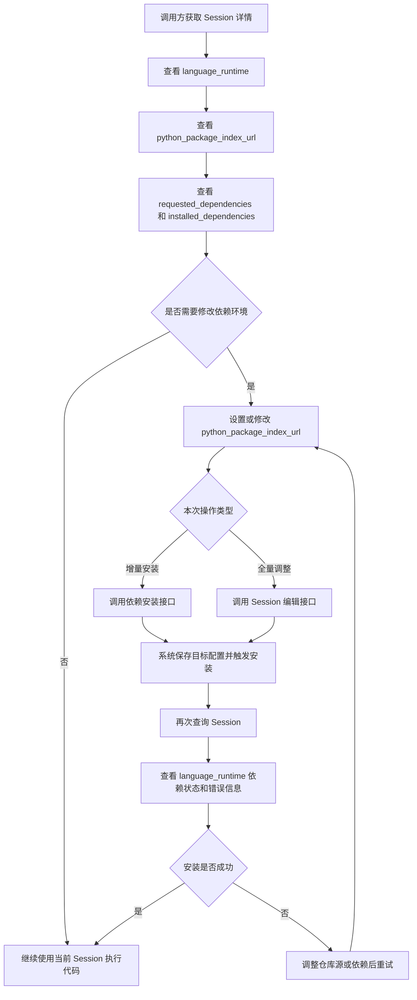

# Session Python 依赖管理 PRD

## 关联设计

- Design: [Session Python 依赖管理实现设计](../../design/features/session-python-dependency-management.md)

## 1. 背景

当前系统已经支持在创建 session 时传入 Python `dependencies`，但能力仍不完整：

- 不支持为 session 显式设置 Python 软件包仓库，当前实现默认写死为官方 PyPI。
- 不支持编辑 session 时变更 Python 仓库和依赖配置。
- 不支持单独触发依赖安装。
- `sandbox_control_plane` 与 `runtime/executor` 之间没有专门的依赖同步接口，依赖安装主要耦合在容器启动阶段。
- 数据库存储了依赖安装状态，但缺少围绕“目标配置”和“动态同步”的完整产品语义。

这会导致以下问题：

- 用户无法切换到企业内部源、镜像源或私有代理源。
- session 创建完成后，无法按需追加依赖或修正依赖版本。
- session 编辑与依赖安装没有统一的状态和错误反馈。
- control plane 无法显式驱动 executor 对运行中 session 执行依赖同步。

## 2. 目标

本期目标是在不改变整体架构前提下，补齐 session 级 Python 依赖管理能力：

1. 创建 session 时支持设置 Python 软件包仓库和依赖。
2. 编辑 session 时支持更新 Python 软件包仓库和依赖。
3. 新增独立的 Python 三方依赖安装接口，支持增量安装。
4. 配置既要保存到数据库，也要真正触发 executor 执行安装。
5. `sandbox_control_plane` 调用 `runtime/executor` 的内部依赖同步接口，保证 session 配置及时同步。
6. API、数据库、状态流转和错误行为对调用方清晰可见。

## 3. 非目标

本期不包含以下能力：

- 不支持 `extra-index-url`、`trusted-host`、认证信息等高级 pip 源配置。
- 不支持非 Python runtime 的依赖管理。
- 不支持在线热更新运行中容器的 CPU、内存、磁盘限制。
- 不要求 `env_vars`、`timeout` 等普通字段在运行中 session 上即时生效。
- 不支持“回滚到安装前依赖环境”的事务性恢复。

## 4. 目标用户与场景

### 4.1 目标用户

- 调用 sandbox 平台 API 的上层业务服务
- 依赖 Python 三方包的 AI Agent / Data Agent
- 需要指定企业镜像源的内部平台调用方

### 4.2 核心场景

#### 场景 A：创建 session 时直接配置依赖

用户创建 Python session 时，传入：

- `python_package_index_url`
- `dependencies`

系统保存配置，并在 session 初始化阶段完成依赖同步安装。
创建接口本身不等待最终安装结果，调用方通过 `GET /api/v1/sessions/{session_id}` 查看最终安装状态。

#### 场景 B：编辑 session 配置

用户对已有 session 执行通用更新，修改：

- `python_package_index_url`
- `dependencies`

其中：

- `dependencies` 按全量替换语义处理，可删除旧依赖。
- 依赖相关字段更新后需要立即触发 executor 同步。
- 其他普通字段如 `cpu/memory/disk/timeout/env_vars` 允许更新配置，但本期只写数据库，不要求在线生效。

#### 场景 C：增量安装依赖

用户希望在已有 session 上追加安装依赖，例如：

- 新增 `pandas`
- 覆盖 `requests` 版本
- 切换仓库源后继续安装

系统通过独立接口执行“增量编辑 + 同步安装”：

- 新依赖与现有目标配置合并
- 按包名去重
- 同名包的新版本覆盖旧版本
- 安装完成后更新 session 目标配置和安装结果

### 4.3 典型产品流程

用户的典型使用路径如下：

1. 先获取 session 详情
2. 查看当前 Python 版本
3. 查看当前已配置/已安装依赖
4. 如有需要，设置 Python 软件包仓库地址
5. 追加安装依赖或编辑依赖配置
6. 再次查询 session，确认安装状态和最终依赖结果



流程说明：

- `language_runtime` 必须在 session 查询接口中返回，方便调用方先确认当前 Python 版本。
- `requested_dependencies` 用于展示目标配置，`installed_dependencies` 用于展示最近一次成功安装后的实际结果。
- 增量安装和全量编辑是两条不同入口，但都会进入同一条后端依赖同步流程。

## 5. 产品规则

### 5.1 Python 包仓库配置

- 字段名：`python_package_index_url`
- 默认值：`https://pypi.org/simple/`
- 本期仅支持单一 `index_url`
- 未传入时使用默认值
- 传入空值时：
  - 创建接口：按默认值处理
  - 编辑/安装接口：按“恢复默认 PyPI”处理

### 5.2 依赖声明格式

沿用当前 API 的 `DependencySpec` 结构：

```json
{
  "name": "requests",
  "version": "==2.31.0"
}
```

规则：

- 包名必填
- 版本约束可选
- 未提供操作符时，服务端按 `==` 处理
- 需继续沿用现有包名校验规则

### 5.3 创建 session 语义

- 创建接口支持传入 `python_package_index_url` 和 `dependencies`
- 创建成功前，配置必须落库
- 如果存在依赖配置，control plane 需要在 session 初始化阶段异步触发 executor 执行首次同步安装
- 创建接口不要求同步返回最终依赖安装结果
- 调用方通过 `GET /api/v1/sessions/{session_id}` 查询：
  - 当前安装状态
  - 安装错误
  - 已安装依赖结果
- 首次安装失败时：
  - 不要求创建接口同步返回安装失败
  - session 保留新的目标配置
  - session 记录失败状态、失败原因、时间戳

### 5.4 编辑 session 语义

- 提供通用 session 更新接口
- 本期允许更新字段：
  - `cpu`
  - `memory`
  - `disk`
  - `timeout`
  - `env_vars`
  - `python_package_index_url`
  - `dependencies`
- 即时生效范围：
  - `python_package_index_url`
  - `dependencies`
- 非即时生效字段：
  - `cpu`
  - `memory`
  - `disk`
  - `timeout`
  - `env_vars`

依赖相关规则：

- `dependencies` 为全量替换语义
- 替换后执行同步安装
- 替换时允许删除旧依赖

### 5.5 依赖安装接口语义

- 新增独立依赖安装接口
- 入参支持：
  - `python_package_index_url`
  - `dependencies`
- 该接口对 `dependencies` 采用增量合并语义：
  - 与 session 当前目标配置合并
  - 按包名去重
  - 同名包用本次请求版本覆盖旧版本
- 本质上是“编辑 session 的依赖配置并立即同步到 executor”
- 该接口要求同步返回本次安装结果：
  - 安装是否成功
  - 安装错误
  - 最新 `installed_dependencies`
  - 最新 session 目标配置

### 5.6 状态与错误语义

沿用 session 现有依赖安装状态字段，并统一语义：

- `requested_dependencies`：当前 session 的目标依赖配置
- `installed_dependencies`：最近一次成功同步后的实际安装结果
- `dependency_install_status`：
  - `pending`
  - `installing`
  - `completed`
  - `failed`
- `dependency_install_error`：最近一次失败原因
- `dependency_install_started_at`：最近一次安装开始时间
- `dependency_install_completed_at`：最近一次安装结束时间

错误处理原则：

- 创建 session 的首次依赖安装失败通过后续 session 查询观察，不要求创建接口同步返回
- 独立依赖安装接口安装失败时，请求返回失败
- 数据库不回滚到旧依赖配置
- 目标配置保留为新值，便于用户查看与重试

### 5.7 适用范围限制

仅 Python session 支持本能力。

以下场景应拒绝：

- 非 Python runtime 的 session 调用依赖相关编辑或安装接口
- `terminated`、`completed`、`failed` 的 session 执行依赖同步
- executor 不可达或响应异常

## 6. API 需求

当前基线文档参考：`docs/api/rest/sandbox-openapi.json`

本期需要扩展如下能力：

### 6.1 创建 session 接口

`POST /api/v1/sessions`

新增请求字段：

- `python_package_index_url`
- `dependencies`

响应需要能体现：

- 当前语言运行时
- 当前 Python 仓库源
- 当前目标依赖配置
- 当前安装状态
- 当前安装错误

说明：

- 创建 session 接口返回的是 session 当前配置快照。
- 由于 executor 依赖同步是异步调度，创建接口不保证返回最终安装结果。
- 如果调用方需要确认首次依赖安装是否完成，应轮询 `GET /api/v1/sessions/{session_id}`。

### 6.2 编辑 session 接口

新增：

- `PATCH /api/v1/sessions/{session_id}`

支持更新：

- `cpu`
- `memory`
- `disk`
- `timeout`
- `env_vars`
- `python_package_index_url`
- `dependencies`

### 6.3 依赖安装接口

新增：

- `POST /api/v1/sessions/{session_id}/dependencies/install`

请求支持：

- `python_package_index_url`
- `dependencies`

响应要求同步返回本次安装结果，包括：

- 最新 session 配置
- 当前安装状态
- 当前安装错误
- 最新 `installed_dependencies`

## 7. 数据存储需求

当前数据库基线参考：`migrations/mariadb/0.2.0/pre/init.sql`

本期需求：

- 在 `t_sandbox_session` 中新增 `python_package_index_url`
- 继续使用现有依赖安装相关字段
- 保证 session 详情查询可返回：
  - 仓库源
  - 目标依赖配置
  - 实际安装结果
  - 安装状态
  - 错误信息
  - 安装时间

## 8. 系统交互需求

### 8.1 控制平面职责

`sandbox_control_plane` 需要：

- 更新创建 session 接口
- 新增编辑 session 接口
- 新增依赖安装接口
- 调用 executor 内部依赖同步接口
- 根据同步结果更新数据库状态

### 8.2 Executor 职责

`runtime/executor` 需要：

- 提供内部依赖同步接口
- 接收 Python 仓库源和依赖列表
- 执行真实安装动作
- 返回安装结果与错误信息

## 9. 成功标准

满足以下标准视为需求完成：

1. 创建 session 时可指定 Python 仓库源和依赖。
2. 编辑 session 时可替换 Python 仓库源和依赖，并触发同步安装。
3. 可通过独立接口对现有 session 做增量依赖安装。
4. 数据库能正确保存目标配置、安装状态、错误信息和安装结果。
5. executor 能被 control plane 显式调用完成依赖同步。
6. OpenAPI 文档完整覆盖新增和更新接口。
7. 失败行为、幂等语义、限制条件对调用方明确。

## 10. 验收场景

### 10.1 创建时安装成功

- Given 创建 Python session 并传入自定义 `python_package_index_url` 和依赖
- When session 创建成功
- Then 数据库保存目标配置
- And executor 在后台完成依赖安装
- And 调用方通过查询 session 看到 `dependency_install_status=completed`

### 10.2 创建时安装失败

- Given 创建 Python session 并传入错误的依赖或错误源地址
- When executor 安装失败
- Then 创建 session 请求不要求同步失败
- And 数据库保留新的目标配置
- And session 返回 `dependency_install_status=failed`

### 10.3 编辑时全量替换依赖

- Given 已存在 Python session，当前依赖为 `requests`
- When 调用编辑接口，将依赖替换为 `numpy`
- Then session 目标依赖配置只保留 `numpy`
- And executor 按替换后的配置执行同步安装

### 10.4 增量安装依赖

- Given 已存在 Python session，当前依赖为 `requests==2.31.0`
- When 调用依赖安装接口，传入 `requests==2.32.0` 和 `pandas`
- Then session 目标依赖配置更新为合并去重后的结果
- And `requests` 版本更新为 `2.32.0`
- And executor 完成增量安装

### 10.5 非 Python session 拒绝

- Given 一个非 Python runtime 的 session
- When 调用依赖编辑或安装接口
- Then 返回业务错误
- And 不执行安装动作

### 10.6 运行中 session 更新普通字段

- Given 一个运行中的 Python session
- When 调用编辑接口修改 `env_vars`、`timeout`、`cpu`
- Then 数据库保存新值
- And 不要求在线修改容器或 Pod

## 11. 依赖与风险

### 11.1 依赖

- `sandbox_control_plane` 与 `runtime/executor` 之间需有稳定的内部 HTTP 通信
- executor 运行环境必须具备 pip 安装能力
- 网络出口和仓库源可达性会直接影响安装成功率

### 11.2 风险

- 运行中 session 重复安装依赖可能引入环境漂移
- 仓库源不可达会放大创建/编辑失败率
- 旧的“容器启动脚本安装依赖”逻辑若与新同步接口并存，可能产生双重安装或状态不一致

本期实现必须收敛到“control plane 驱动 executor 同步”为主路径，避免出现多套事实来源。
