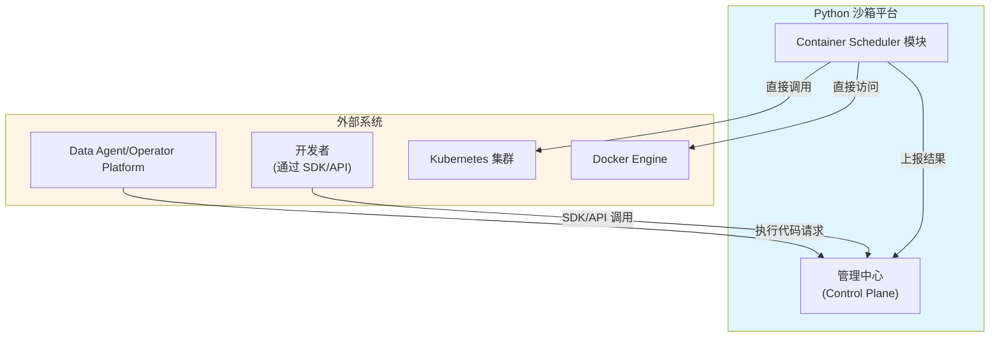
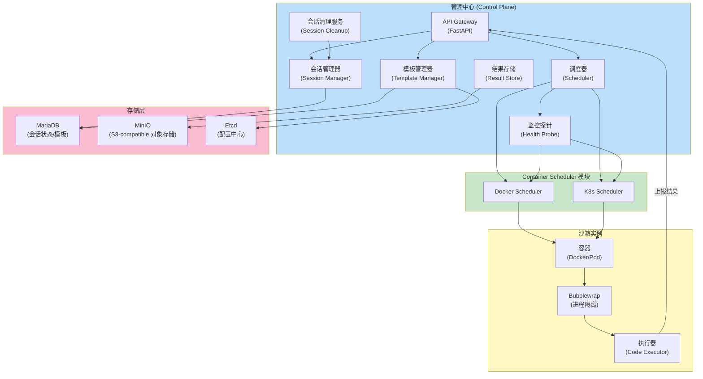
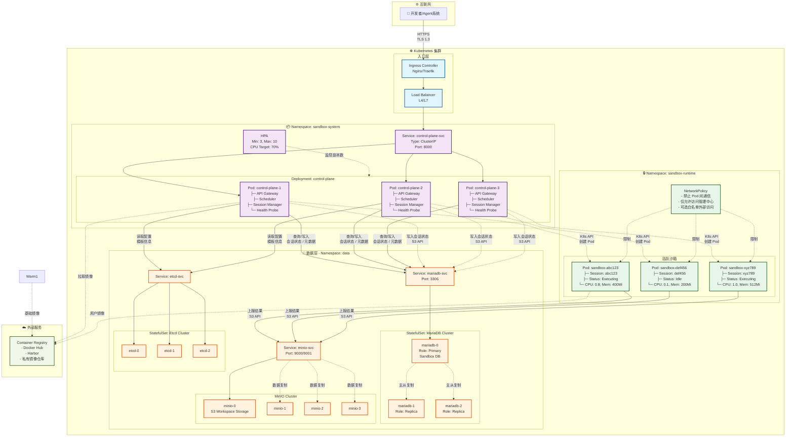

# 1. 架构设计

> **文档导航**: [返回首页](index.md)

## 1. 架构设计
### 1.1 整体架构

系统采用管理中心（Control Plane）与容器调度器（Container Scheduler）分离的云原生架构，支持 Docker 和 Kubernetes 两种部署模式。
核心设计原则：

- 控制平面无状态，支持水平扩展
- 容器调度器池化管理，动态伸缩
- 协议驱动的解耦设计
- 多层安全隔离
- 异步高并发处理

### 1.2 C4 架构模型
#### C4 Level 1: 系统上下文

外部交互：

- DataAgent/Operator Platform 系统通过 RESTful API 发起代码执行请求
- 开发者通过 Python SDK 集成沙箱能力
- 依赖 Kubernetes/Docker 提供容器基础设施

#### C4 Level 2: 容器视图

关键容器：

- API Gateway: 统一入口，基于 FastAPI 实现
- 调度器: 智能任务分发和资源调度
- 会话管理器: 会话生命周期管理
- Container Scheduler: Docker/K8s 运行时实例管理
- 存储层：
  - MariaDB（会话状态/模板/执行记录）
  - MinIO（S3-compatible 对象存储，workspace 文件）
  - Etcd（配置中心）

**存储架构说明**：
- Control Plane 通过 S3 API 将文件写入 MinIO 的 /sessions/{session_id}/ 路径
- Executor Pod 使用 s3fs init container 挂载 S3 bucket 的 session 子目录到 /workspace
- 不再需要 JuiceFS 元数据数据库和 CSI 驱动
- 执行时生成的文件通过 S3 API 直接写入 MinIO
- MariaDB 存储 stdout、stderr、执行状态和文件列表（artifacts）
- 下载文件时通过文件 API 直接从 MinIO 获取

> 详细存储架构请参考 [10. MinIO-Only 存储架构](10-minio-only-architecture.md)

#### 部署架构
